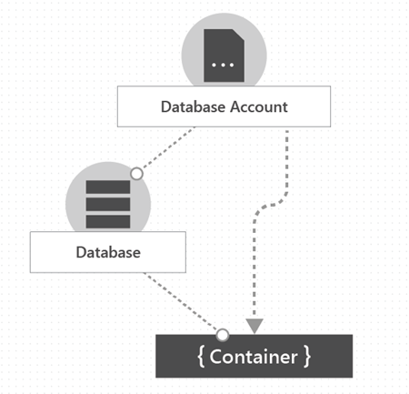

<h1 style="text-align: center;"><strong>CosmosDB</strong></h1>

  

# Elements in an Cosmos DB account
Currently, you can create a maximum of 50 Cosmos DB accounts under a subscription. The following shows the hierarchy of elements in a Cosmos DB account.

The following shows the hierarchy of entities in a Cosmos DB account.

In Cosmos DB, a database is similar to a namespace. A database is simply a group of containers. A container is a group of items. An item is a JSON document.

  

# Cosmos DB containers
A Cosmos DB container is where data is stored. Unlike most relational databases, which scale up with larger sizes of VMs, Cosmos DB scales out. Data is stored on one or more servers called partitions. To increase partitions, you increase throughput, or they grow automatically as storage increases. This relationship provides a virtually unlimited amount of throughput and storage for a container.

When you create a container, you need to supply a partition key. The partition key is a property that you select from your items to help Cosmos DB distribute the data efficiently across partitions. Cosmos DB uses the value of this property to route data to the appropriate partition. You can also use the partition key in `WHERE` clause in queries for efficient data retrieval.

The underlying storage mechanism for data in Cosmos DB is called physical partition. Physical partitions can have a throughput amount up to 10,000 Request Units per second, and they can store up to 50 GB of data. Cosmos DB abstracts this partitioning concept with a logical partition, which can store up to 20 GB of data. Logical partitions allow service to provide greater elasticity and better management of data on the underlying physical partitions as you add more partitions.

When you create a container, you configure throughput in one of followings:

1. Dedicated throughput: The throughput on a container is exclusively reserved for that container. There are two types of dedicated throughput: [standard](https://learn.microsoft.com/en-us/azure/cosmos-db/how-to-provision-container-throughput) and autoscale.

2. Shared throughput: Throughput is specified at database level and then shared with up to 25 containers within database. Sharing of throughput excludes containers that are configured with their own dedicated throughput.

    Shared throughput can be a good option when all containers in the database have similar requests and storage needs, or when you don't need predictable performance on the data.

> You can't switch between dedicated and shared throughput. Containers that you created in a shared throughput database can't be updated to have dedicated throughput. To change a container from shared to dedicated throughput, you must create a new container and copy data to it. The [container copy](https://learn.microsoft.com/en-us/azure/cosmos-db/container-copy) can make this easier.

Containers are schema agnostic. Items within a container can have arbitrary schemas or different entities, as long as they share same partition key. By default, all data that you add to a container is automatically indexed without requiring explicit indexing. You can customize the indexing for a container by configuring its [indexing policy](https://learn.microsoft.com/en-us/azure/cosmos-db/index-overview).

To avoid affecting performance, you can set a TTL on selected items in a container or on the entire container to delete those items automatically in the background with unused throughput. However, even if expired data isn't deleted, it doesn't appear in any read operations.

  

# Backup
Two backup modes:

1. [Continuous backup](https://learn.microsoft.com/en-us/azure/cosmos-db/continuous-backup-restore-introduction) – Two tiers. One includes 7-day retention and the second includes 30-day retention. Continuous backup allows to restore to any point of time into new or existing account.

2. [Periodic backup mode](https://learn.microsoft.com/en-us/azure/cosmos-db/periodic-backup-restore-introduction) - Default mode for all existing accounts.

FAQ:
1. Can I restore from an account A in subscription S1 to account B in a subscription S2?

    No. You can only restore between accounts within the same subscription.

2. Can I restore into an account that has fewer partitions or low provisioned throughput than the source account?

    No. You can't restore into an account with lower RU/s or fewer partitions.

  

# Global Distribution

  

# References
- [Cosmos DB documentation](https://learn.microsoft.com/en-us/azure/cosmos-db/)