# <center>End-to-end Sample</center>

<br></br>


## Register App with Microsoft Entra ID
Microsoft Entra ID helps integrate your app with Microsoft identity platform to provide authentication and authorization. To connect your application to Microsoft identity, you need to register app in Microsoft Entra ID.

App registration builds a trusted relationship between application and Microsoft identity platform. It provides unique information (application ID and tenant ID) that application can use to retrieve access token. The application can use the access token to make Microsoft Graph calls to M365 services (and others) in your organization.

During app registration process, you need to set configuration options:

* Specify who can access application by selecting one of following supported account types.
    * Accounts in this organizational directory only (Single tenant): allow only users in your tenant to use your application.
    * Accounts in any organizational directory (Multi-tenant): allow users in any Microsoft Entra tenant to use your application.
    * Accounts in any organizational directory (Multi-tenant) and personal Microsoft accounts: targets the widest set of customers.
    * Personal Microsoft accounts only: allow only users who have personal Microsoft accounts to use your application.
* Provide a redirect URI for web and single-page app. This URI is the location where Microsoft identity platform redirects user's client and sends security tokens after authentication.

<br>


### Exercise
1. Go to Microsoft Entra [admin center](https://aad.portal.azure.com).

2. Select Identity -> Applications -> App registrations from the left-side menu.

    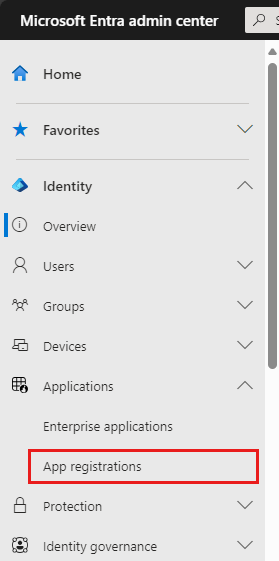

3. Select App registrations.

4. Create a new app registration by selecting New registration.

    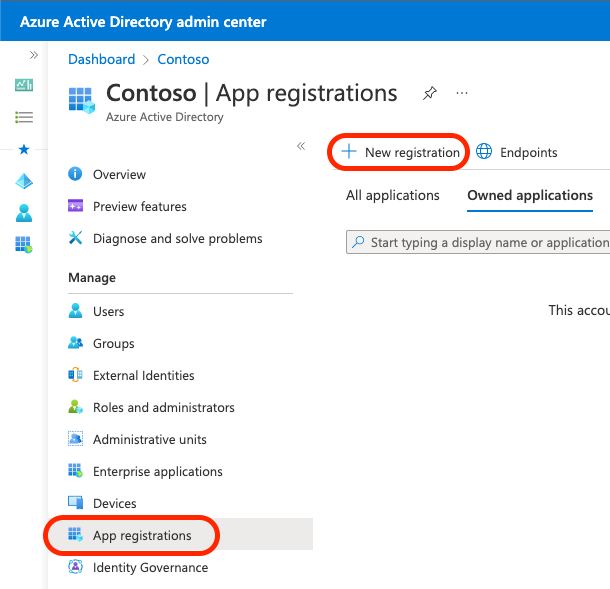

5. For Name, give a name for your application, such as spa-aad-app.

6. For Supported account types, select Accounts in this organizational directory only (Single tenant).

7. For Redirect URI (optional), select Single page application (SPA).

8. In the box for the redirect URI, enter http://localhost:8080.

9. Select the Register button.

    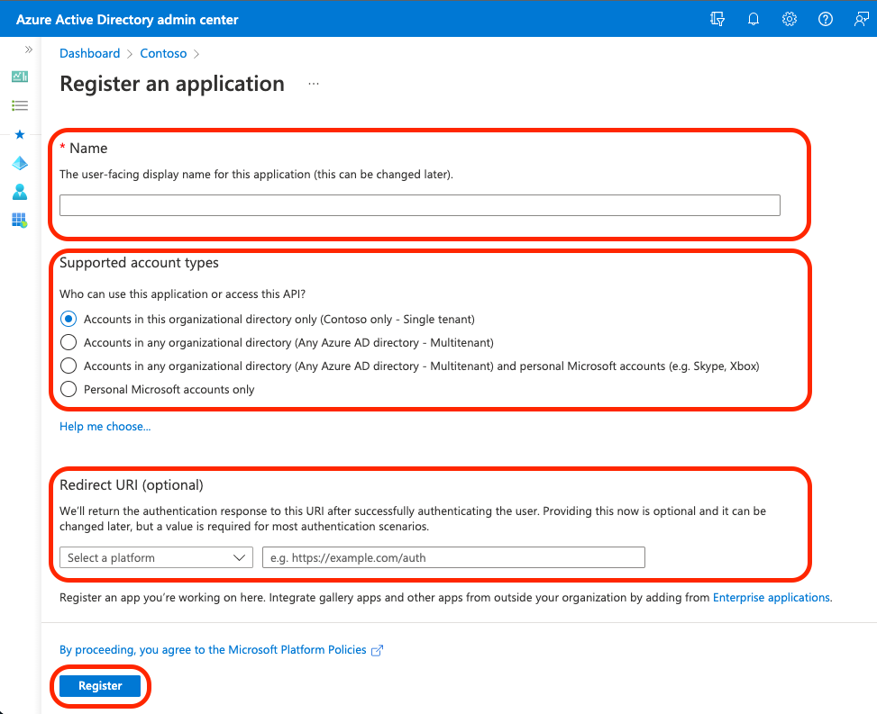

10. After your application is successfully registered, select Overview.

11. Copy the Application (client) ID and Directory (tenant) ID values and save them somewhere.

    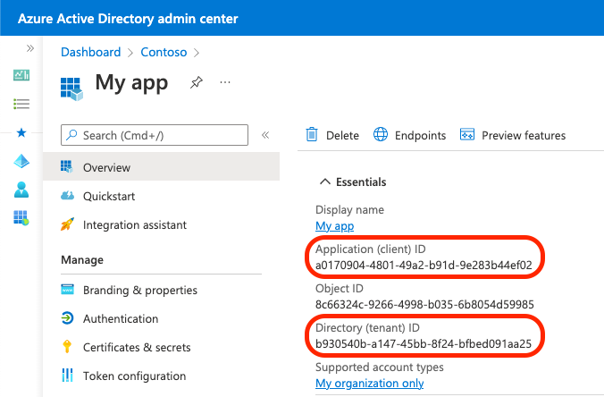

<br></br>


## Retrieve an access token by using MSAL
Now you'll learn how to retrieve an access token so your team can use it to build customer application.

Token interaction can be challenging if you don't use a library to abstract away the protocol details, validation, token caching, and security. You can use a library called Microsoft Authentication Library (MSAL) 2.0 to simplify this process.

MSAL enables developers to acquire tokens from the Microsoft identity platform to authenticate users and access secured web APIs like Microsoft Graph. MSAL is also available in other platforms such as .NET, iOS, and Android.

One of the authentication flows for the application that uses MSAL is as follows:

1. The application redirects the user to sign in.
2. The user signs in successfully and requests an authorization code.
3. The authorization code is returned to the application.
4. The application requests the token by using the authorization code.
5. The access token and other information are returned after successful validation.
6. The application can call Microsoft Graph services with an access token in the authorization header.
7. Microsoft Graph validates the token.
8. Microsoft Graph sends back the response.

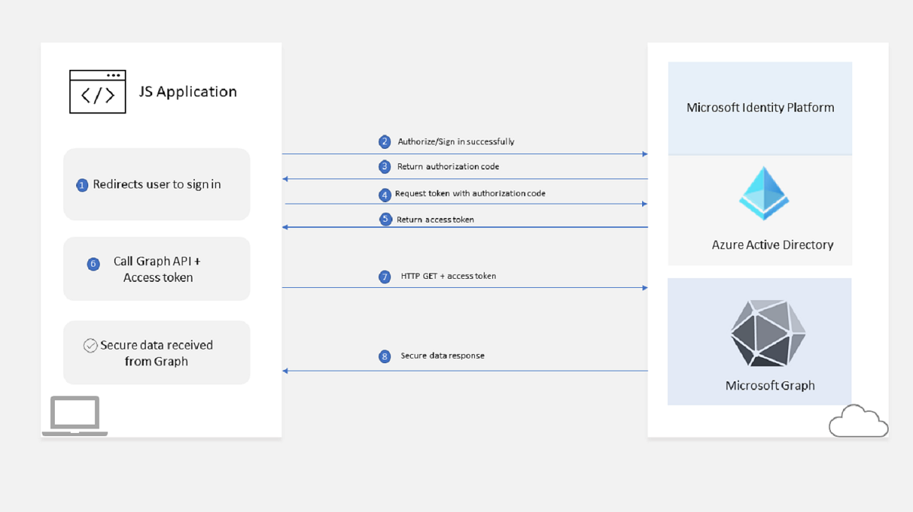

<br>


### Exercise
[JS example of retrieving an access token by using MSAL](https://learn.microsoft.com/en-us/training/modules/msgraph-javascript-app/7-exercise-retrieve-access-token)

<br></br>


## E2E Exercise
The scenario is your company is building a ASP.NET Core web app that allows salespeople to work with customers. One goal of this app is to help a sales team manager arrange a meeting with customer’s account manager. The app checks the availability of account manager and provides a list of available times. The sales team manager can select the most suitable time and the app then schedules the meeting on their behalf.

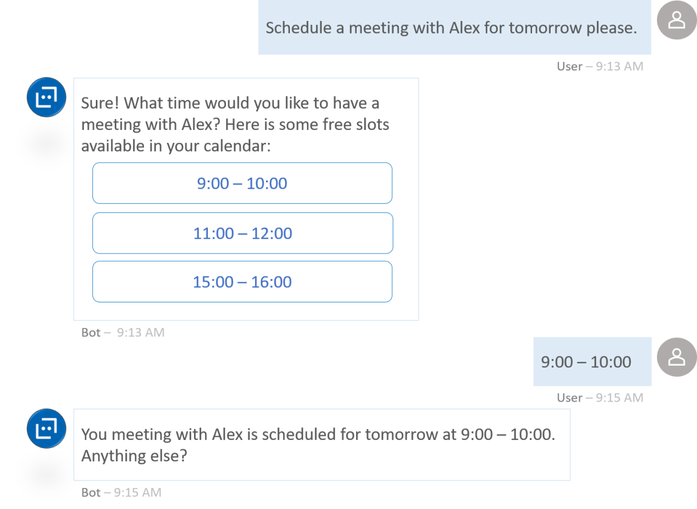

<br>


### Configure Microsoft Entra app to connect to M365
Create a new Microsoft Entra application registration:

1. Go to [Entra admin center](https://aad.portal.azure.com) and sign-in using M365 developer account.

2. On the menu, select Microsoft Entra ID.

    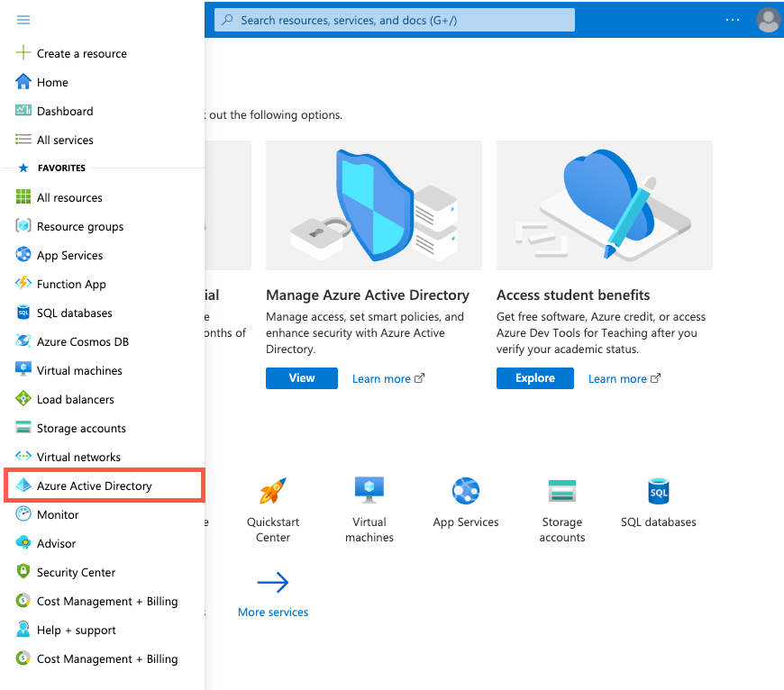

3. Select `App registrations` from left menu.

4. Create a new app registration by selecting `New registration` in toolbar.

    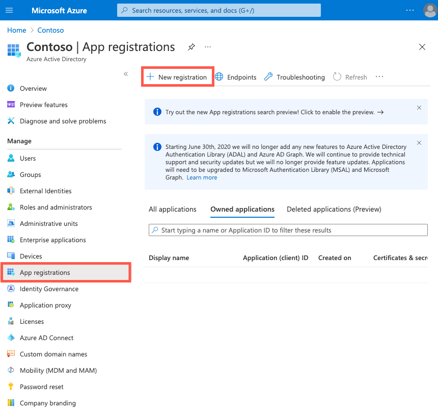

5. On the `Register an application` screen, enter followings:
    * Name: enter a name for your application.
    * Supported account types: select `Accounts in any organizational directory (Any Microsoft Entra directory - Multitenant)`.
    * Redirect URI (optional): select Web and enter `https://localhost:5001`.
    * Select `Register`.

    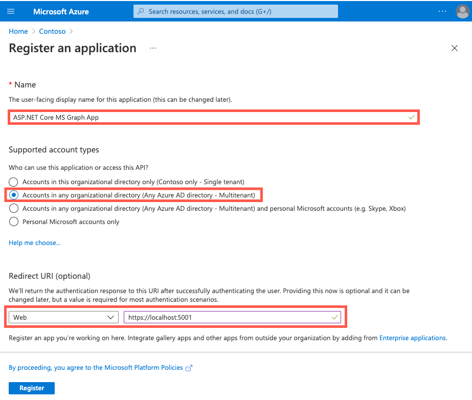

6. Once the app is created, copy `Application (client) ID` and save it. This value can be found on the `Overview`.

    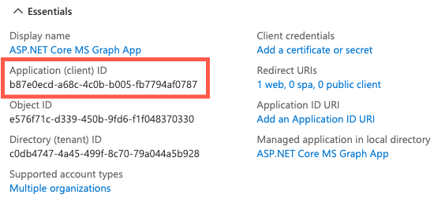

7. Select `Authentication` under `Manage`.

    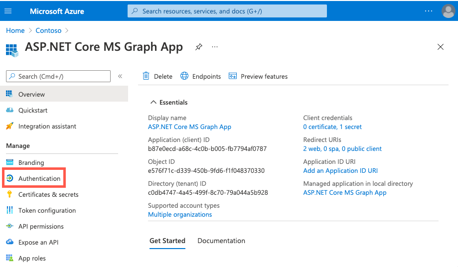

8. On the app's `Authentication` screen, enter followings:
    * `Web / Redirect URIs`: select `Add URI` and enter `https://localhost:5001/signin-oidc`.
    * `Front-channel logout URL`: enter `https://localhost:5001/signout-oidc`.
    * `Implicit grant and hybrid flows`: select `ID tokens`.
    * Select `Save`.

    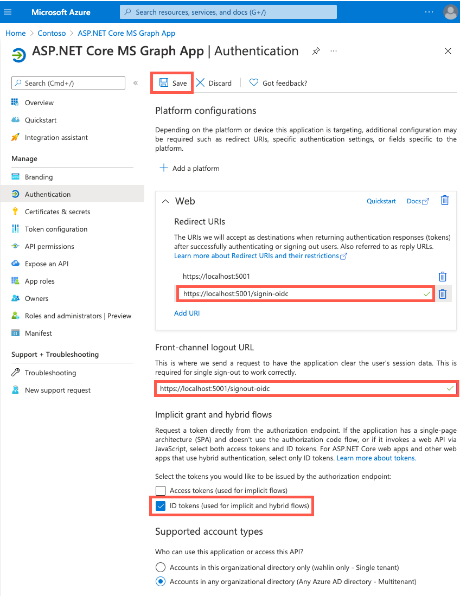

9. Select `Certificates & secrets` under `Manage`.

10. Select `New client secret`. Enter a value of `App Client Secret` in  `Description` and select any of the options for `Expires`. Select `Add` to create secret.

    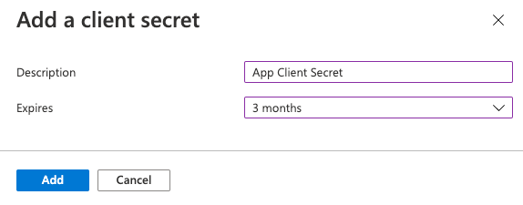

11. Copy the client secret `Value`.

    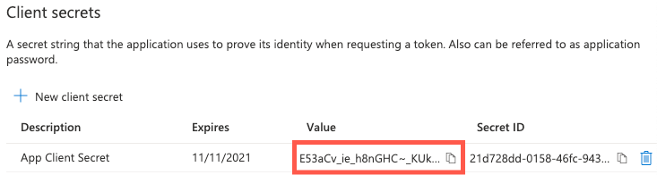

<br>


### Authenticate to access data from M365
Configure the sample app:
1. Open `appsettings.json` and change `Scopes` property to following to allow access to read a user's profile and presence, mailbox settings, and calendars.

    ```
    user.read presence.read mailboxsettings.read calendars.read
    ```

2. To add Microsoft Entra ID `ClientId` and `ClientSecret` values, you’ll use ASP.NET Core app secrets.

    ```shell
    $ dotnet user-secrets init
    $ dotnet user-secrets set "AzureAd:ClientId" "YOUR_APP_ID" // Application (client) ID
    $dotnet user-secrets set "AzureAd:ClientSecret" "YOUR_APP_SECRET" // application secret
    ```

    > You can store sensitive information in a secure location such as Azure Key Vault.

<br>


### Specify the necessary permissions
All data exposed by Microsoft Graph is secured and app needs to have the right permissions granted to access it. For example, to access user’s calendar, app needs to have `Calendars.Read` permission. The list of permissions required for each operation is available in  Microsoft Graph API reference.

The list of permissions granted to app is baked right into access token. The OAuth standard calls them "scopes". When app uses MSAL to get access token, it needs to include a list of scopes in request to Microsoft Entra ID. Each operation in Microsoft Graph has its own list of scopes. If access token doesn’t have one of them, the request will be denied.

The sample app stores the required permissions in `appsettings.json` in a `Scopes` property.

```
"Scopes": "user.read presence.read mailboxsettings.read calendars.read"
```

The `Scopes` value is used by app’s ASP.NET Core middleware, which handles retrieving an access token after user successfully signs in.

<br>


### Middleware: Microsoft identity platform and Microsoft Graph
ASP.NET Core supports middleware that can be used to authenticate and authorize users. It can also be used to retrieve a token that can be used to call Microsoft Graph, create a token cache, and more. Middleware is configured in `Startup.cs` and handles the following tasks:
- Retrieve required permissions defined in `Scopes` from `appsettings.json`.
- Add support for OpenId authentication.
- Specify that app is a Microsoft identity platform web app that requires an auth code flow.
- Add the ability to call Microsoft Graph APIs with specific permissions.
- Enable dependency injection for `GraphServiceClient` (an object provided by Microsoft Graph SDK that is used to make Microsoft Graph calls).
- Add in-memory token cache.
- Require an authenticated user to access the app.
- Add Microsoft Identity UI pages that provide user sign in and sign out support.

```csharp
// startup.cs
// 1. Retrieve required permissions from appsettings
string[] initialScopes = Configuration.GetValue<string>("DownstreamApi:Scopes")?.Split(' ');

services
  // 2. Add support for OpenId authentication
  .AddAuthentication(OpenIdConnectDefaults.AuthenticationScheme)
  // 3. Microsoft identity platform web app that requires an auth code flow
  .AddMicrosoftIdentityWebApp(Configuration)
  // 4. Add ability to call Microsoft Graph APIs with specific permissions
  .EnableTokenAcquisitionToCallDownstreamApi(initialScopes)
  // 5. Enable dependency injection for GraphServiceClient
  .AddMicrosoftGraph(Configuration.GetSection("DownstreamApi"))
  // 6. Add in-memory token cache
  .AddInMemoryTokenCaches();

// 7. Require an authenticated user
services.AddControllersWithViews(options =>
{
  var policy = new AuthorizationPolicyBuilder()
      .RequireAuthenticatedUser()
      .Build();
  options.Filters.Add(new AuthorizeFilter(policy));
});

services
  // 8. Add Razor Pages support
  .AddRazorPages()
  // 9. Add Microsoft Identity UI pages that provide user
  // sign-in and sign-out support
  .AddMicrosoftIdentityUI();
```

<br></br>


## References
* [Access user photo information by Microsoft Graph](https://learn.microsoft.com/en-us/training/modules/msgraph-user-photo-information/)
* [Create ASP.NET MVC web app and register Microsoft Entra app](https://learn.microsoft.com/en-us/training/modules/msgraph-build-aspnetmvc-apps/3-exercise-create-app)
* [Access a user's calendar events in an ASP.NET Core app with Microsoft Graph](https://learn.microsoft.com/en-us/training/modules/msgraph-dotnet-core-access-user-events/)
* [Download and upload files in an ASP.NET Core app with Microsoft Graph](https://learn.microsoft.com/en-us/training/modules/msgraph-dotnet-core-manage-files/)