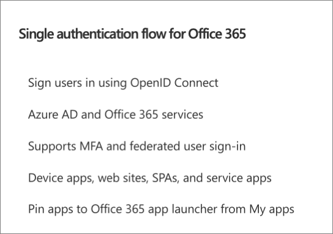
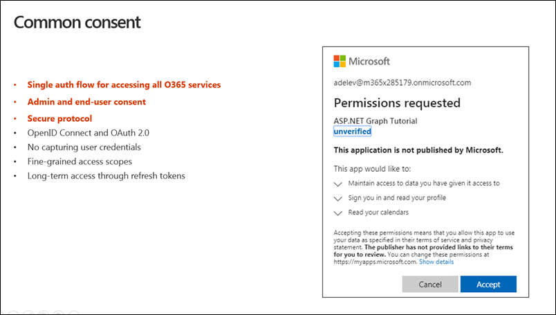

# <center>Microsoft Graph</center>

<br></br>


## What
Microsoft Graph is the gateway to data and intelligence in M365. It provides a unified programmability model that you can use to access the data in M365, Windows 10, and Enterprise Mobility + Security. It offers a secured, unified API to connect to data located in various M365 services:

- Users and groups
- Teams data
- Tasks
- Files
- Mail
- Meetings and calendars
- Organizational charts

> Microsoft Graph is used to access M365 data and isn't related to other graph technologies, such as graph databases or GraphQL.


Common Use Cases:
- User and Group Management:

    Automate the management of users and groups within an organization, including creating and updating user profiles, managing group memberships, and handling directory roles. Microsoft Graph services are centered on users and groups. A user's data is the core of M365 cloud services. Groups are the base environment for a user's collaboration and teamwork in M365.

- Mail, Calendar, and Contacts:

    Access and manipulate Outlook mail, calendar events, and contacts to build applications that integrate with users' email and scheduling needs.

- Files and Documents:

    Interact with OneDrive and SharePoint files, enabling applications to upload, download, and manage documents and files stored in the cloud.

- Collaboration Tools:

    Integrate with Microsoft Teams to create bots, manage teams and channels, and facilitate real-time collaboration within your applications.

- Analytics and Insights:

    Use advanced analytics to gain insights into user behavior, productivity patterns, and organizational trends.

<br>


### Key Features and Components of Microsoft Graph
- Unified Endpoint:

    Microsoft Graph provides a single endpoint (`https://graph.microsoft.com`) that developers can use to access a variety of M365 services, including Azure Active Directory, Outlook, OneDrive, SharePoint, Teams, and more.

- Rich Data Access:

    With Microsoft Graph, you can access data about users, groups, mail, calendars, contacts, files, tasks, and more across the Microsoft 365 suite. This makes it a versatile tool for developing applications that need to interact with different types of organizational data.

    Microsoft Graph [connectors](https://learn.microsoft.com/en-us/microsoftsearch/connectors-overview) work in the incoming direction, delivering data external to the Microsoft cloud into Microsoft Graph services and applications, to enhance M365 experiences such as Microsoft Search. Connectors exist for many commonly used data sources such as Box, Google Drive, Jira, and Salesforce.

    Microsoft Graph [Data Connect](https://learn.microsoft.com/en-us/graph/overview#access-microsoft-graph-data-at-scale-using-microsoft-graph-data-connect) provides a set of tools to streamline secure and scalable delivery of Microsoft Graph data to popular Azure data stores. The cached data serves as data sources for Azure development tools that you can use to build intelligent applications.

- Authentication and Permissions:

    Microsoft Graph uses OAuth 2.0 for authentication and authorization. It supports granular permission scopes, which allow applications to request the minimum permissions necessary for their functionality, enhancing security.

- Insights and Intelligence:

    For example, you can use the Graph API to get insights about user activities, trends, and relationships within an organization.

- Extensibility:

    Developers can extend Microsoft Graph by creating custom connectors and integrating their own data sources.

<br>


### API Example
For example, to access a specific user's profile, the application can use the following Microsoft Graph REST API call:

```
GET /users/michellec@M365x214355.OnMicrosoft.com
```

That REST API call returns profile information about Michelle that can be displayed in the application.

```json
{
  ...
  "displayName": "Michelle Caruana",
  "givenName": "Michelle",
  "jobTitle": "Development Manager",
  "mail": "michellec@M365x214355.OnMicrosoft.com",
  "mobilePhone": "425-555-0132",
  "officeLocation": null,
  "preferredLanguage": "en-US",
  "surname": "Caruana",
  "userPrincipalName": "michellec@M365x214355.OnMicrosoft.com",
  "id": "4cdd269d-559f-4360-a12a-92525f712d8c"
}
```

The application can get information about Michelle's direct reports by using the following REST API call:

```
GET /users/michellec@M365x214355.OnMicrosoft.com/directReports
```

```json
{
...
  "value": [
    {
      "displayName": "Pradeep Gupta",
      "givenName": "Pradeep",
      "jobTitle": "Project Manager",
      "mail": "PradeepG@M365x214355.onmicrosoft.com",
      ...
    },
    {
      "displayName": "Jordy Smith",
      "givenName": "Jordy",
      "jobTitle": "Accountant",
      "mail": "Jordy@M365x214355.onmicrosoft.com",
      ...
    },
    {
      "displayName": "Bridgette Johnson",
      "givenName": "Bridgette",
      "jobTitle": "Designer",
      "mail": "BridgetteJ@M365x214355.onmicrosoft.com",
      ...
    }
  ]
}
```

In addition to making direct calls to Microsoft Graph REST APIs, you can use the Microsoft Graph SDK and client libraries to simplify the process of calling an API.

- [REST Doc](https://learn.microsoft.com/en-us/training/modules/microsoft-graph/3-microsoft-graph-api)
- [SDK Doc](https://learn.microsoft.com/en-us/training/modules/microsoft-graph/4-microsoft-graph-sdk)

<br></br>


## Permissions or Scopes
Microsoft Graph permissions contain scopes that control the access that app has to specific resources, such as users, mail, and files. Scopes also control the operations that can be performed on those resources. The following example pattern defines a permission for a Microsoft Graph operation for a resource:

```
Resource-name.operation.constraint
```

For example, `User.Read.All` grants an application the permission to read the profile of all users in a directory. To read the profile of a signed-in user, the permission required is `User.Read`.

<br>


### Permission types
There are two types of permissions in Microsoft Entra ID:

1. Application uses delegated permission when it's making a Microsoft Graph call on behalf of user. The user can consent to some permission scopes, such as `User.Read`. But some permission scopes are highly privileged and require consent from an administrator. An example is `Channel.Delete.All`, which deletes channels in any team on behalf of signed-in user.

    The simplest example of a delegated permission scope is `User.Read`, which is required to call `/me` endpoint. In Microsoft Graph, all API calls with `/me` use currently signed-in user's context.

2. Application permission doesn't require a signed-in user in the application. It's often used when a user isn't present, such as in background process or to elevate permission. An administrator consents to the permission in advance.

    An example is `Calendars.ReadWrite`, which allows app to create, read, update, and delete events of all calendars without a signed-in user. You can't use `/me` API for an application permission scope, because there's no signed-in user to pull out that information.

<br>


### Access tokens
After application has requested permission, and a user or administrator has consented, the application can obtain an access token from the Microsoft identity platform. Your application gives an access token to Microsoft Graph to prove that it has permission to access M365 data.

Microsoft Graph requires a valid access token in HTTP header of every request. It's passed in authorization header of each HTTP request with word "Bearer" and a space before it. That is, anyone who has ticket can get in without proving their identity. For this reason, Microsoft Graph requires HTTPS encryption on all requests. Access tokens are valid for only a short period, typically one hour.

Here's an example of what an authorization header might look like for a Microsoft Graph request:

```
GET https://graph.microsoft.com/v1.0/me/ HTTP/1.1
Host: graph.microsoft.com
Authorization: Bearer EwAoA8l6BAAU ... 7PqHGsykYj7A0XqHCjbKKgWSkcAg==
```

<br></br>


## How to Use
### Single authentication flow


Microsoft Graph simplifies token acquisition because with all of these different services in Microsoft 365, we would have to obtain a separate access token for each one of them.

Microsoft Graph proxies the different services together so we don't need to obtain individual tokens for each service. Before Microsoft Graph, developers had to use a discovery service to ask the different endpoints with Microsoft 365 for the user-specific endpoints for each service, such as OneDrive or Outlook.

<br>


### Authentication and the consent framework


Office 365 has a single authentication flow that Microsoft Graph also uses. Users sign in using a technology called OpenID Connect, which is an open standard. OpenID Connect is a wrapper to the OAuth 2.0 authentication protocol that will include details about the individual who's logged in.

Microsoft Entra ID is used for all of the authentication. Microsoft Graph uses the same authentication model as Azure and Office 365 that is built on top of the authentication model of Microsoft Entra ID. Both of these services trust Microsoft Entra ID and by having this shared trust, we can leverage the authentication to take advantage of both of these different services with the same authentication flow.

This authentication flow also supports MFA, and federated user sign-ons. One of the concepts with Microsoft Entra ID is the common consent framework. To best understand consent, think about permissions in the concept of a triangle. One point of the triangle is the permission, another point is the user or the application, and the last point is the resource that you're trying to talk to. The user needs to have the permission to the resource to talk to it.

The first time the user signs into Microsoft Entra ID, to obtain an access token to authenticate with Microsoft Graph, Microsoft Entra first checks see if this user has granted this application access to the Microsoft Graph. It specifically checks to see if the app has been granted access to these permissions.

The way that this works is that if the user hasn't gone through this process, the common consent framework kicks in and after they sign-in you'll see the dialog shown in the previous image above.

When the user hasn't granted the permission to the endpoint, to the application, the consent framework prompts them to do so. This process is called delegated consent.

<br>


### Authentication options
Microsoft Graph supports two options:
1. Microsoft Entra-only, or a work or school account.
2. Microsoft Entra ID and or Microsoft accounts.

<br></br>


## References
- [Microsoft Graph Doc](https://learn.microsoft.com/en-us/graph/?WT.mc_id=m365-16105-cxa)
- [Microsoft Graph SDK](https://learn.microsoft.com/en-us/graph/sdks/sdks-overview?WT.mc_id=m365-16105-cxa)
- [Graph Explorer](https://developer.microsoft.com/en-us/graph/graph-explorer)
- [Microsoft Graph REST API v1.0](https://learn.microsoft.com/en-us/graph/api/overview?view=graph-rest-1.0)
