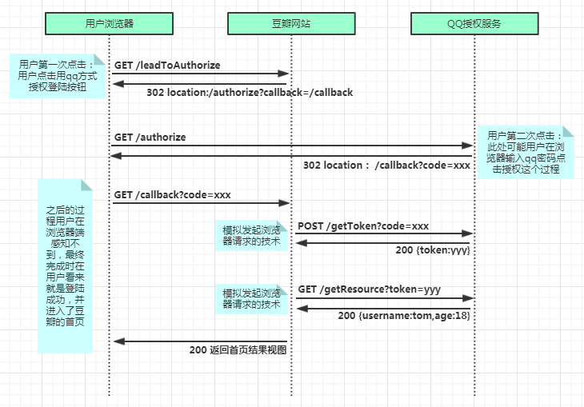

# <center>Authentication</center>

<br></br>


## What
Authentication is validating the identity is who they proclaim to be.

<br></br>


## Common Identity Communication Protocols
- OpenID provider - OpenID Connect (OIDC) is an authentication protocol based on OAuth2 protocol (which is used for authorization). OIDC uses standardized message flows from OAuth2 to provide identity services. Specifically, a system entity (OpenID-Provider) issues JSON-formatted identity tokens to OIDC relying parties via RESTful.

- SAML identity provider - Security Assertion Markup Language (SAML) is an open standard for exchanging authentication and authorization data between identity provider and service provider. SAML is XML-based markup language for security assertions, which are statements that service providers use to make access-control decisions.

- WS-Fed, Web Services Federation - An identity specification from Web Services Security framework to provide SSO via external identity exchange and authentication.

> Federated identity. Federation is a collection of domains that have established trust. The level of trust varies, but typically includes authentication and almost always includes authorization. This federation allows you to apply existing identities from trusted sources, like an existing on-premises active directory.

<br>


### OpenID Connect
This protocol enables user to sign in a user to an app. When you use identity platform's implementation of OpenID Connect, you can add sign-in and API access to your apps. OpenID Connect extends OAuth 2.0 authorization protocol for use as an authentication protocol, so that you can do SSO using OAuth. OpenID Connect introduces the concept of ID token, which is a security token that allows client to verify identity of user. The ID token also gets basic profile information about user. It also introduces UserInfo endpoint, an API that returns information about user.

<br>


### Claims-based identity in Entra ID
When a user signs in, Entra ID sends  ID token that contains a set of claims about user. A claim is a piece of information, expressed as a k/v pair. Claims have an issuer (in this case, Entra ID), which is the entity that authenticates user and creates claims. You trust the claims because you trust the issuer.

At a high level:
1. The user authenticates.
2. The Identity Provider (IDP) sends a set of claims.
3. The app normalizes or augments the claims (optional).
4. The app uses claims to make authorization decisions.

In OpenID Connect, the set of claims you get are controlled by the scope parameter of authentication request. However, Entra ID issues a limited set of claims through OpenID Connect via a security token; primarily using JSON Web Tokens. If you want more information about user, you need to use Graph API with Entra ID.

There are some common terms used when discussing claims-based identity in Entra ID.

* Claim - a value pair of data within a security token. There are multiple claims transferred within token from the claim that defines the type of token to encryption method. Example:

    ```
        Header
        {
            "alg": "HS256",
            "typ": "JWT"
        }
        Content payload
        {
            "sub": "1234567890",
            "name": "John Doe",
            "aud": "https://jwt.io"
        }
    ```
* Assertion - a package of data, usually in form of token that share identity and security information about user across security domains.
* Attribute - a value pair of data within token.
* Augmentation - the process of adding other claims to user token to provide extra detail about the user. This could include data from HR systems, from an app like SharePoint.

<br>


### Security tokens
Identity platform authenticates users and provides security tokens, such as access tokens, refresh tokens, and ID tokens. Security tokens allow client app to access protected resources on a resource server. There are three common types of tokens:
1. Access token - It is a security token that's issued by an authorization server as part of OAuth 2.0 flow. It contains information about the user and the resource for which the token is intended. The information can be used to access web APIs and other protected resources. Access tokens are validated by resources to grant access to a client app.
2. Refresh token - Because access tokens are valid for only a short period of time, authorization servers will sometimes issue a refresh token at same time the access token is issued. The client app can then exchange this refresh token for a new access token when needed.
3. ID token - Sent to client app as part of OpenID Connect flow. They can be sent alongside or instead of access token. ID tokens are used by client to authenticate user.

<br>


### OAuth v2 Authorization Grant Flow


Let's explore how OAuth v2 authorization grant flow works once it obtains the access token. The above diagram is an overview of the entire process from the ASP.NET MVC app on the left, the two Microsoft identity v2 endpoints for authorization and token acquisition, and ultimately Microsoft Graph on the right.

Once the access token is acquired, app is going to call Microsoft Graph without having to go through the steps to obtain the access token again. Instead, the app caches the access token locally and it keeps using it until at some point where that token expires.

In this case, a refresh token is used to obtain a new access token without requiring user to sign in again. This is one of the advantages to using MSAL because while it's important to understand what is happening, MSAL handles this token caching and, when necessary, refreshing the token.

Your code follows a simple pattern to acquire a token silently. If that fails, your app will then guide the user through acquiring the interactively. Silently acquiring the token means that MSAL first tries to retrieve the token from cache or by using a refresh token if the token has expired.

<p align="center">
  
</p>

OAuth在客户端与服务提供商间，设置一个授权层（authorization layer）。客户端不能直接登录服务提供商，只能登录授权层，以此将用户与客户端分开。客户端登录授权层用的令牌（token），与用户密码不同。用户可在登录时，指定授权层令牌权限范围和有效期。

客户端登录授权层后，服务提供商根据令牌权限范围和有效期，向客户端开放用户储存的资料。

运行流程:

<p align="center">
  
</p>

1. 打开客户端后，客户端要求用户授权。
2. 用户同意授权。
3. 客户端使用授权向认证服务器申请令牌。
4. 认证服务器对客户端认证后同意放令牌。
5. 客户端使用令牌，向资源服务器申请获取资源。
6. 资源服务器确认令牌，同意向客户端开放资源。

客户端须得到用户授权（authorization grant）才能获得令牌（access token）。OAuth 2.0定义四种授权方式：
1. 授权码模式（authorization code）
2. 简化模式（implicit）
3. 密码模式（resource owner password credentials）
4. 客户端模式（client credentials）

<br></br>


## JSON Web Token (JWT)
It is an open standard that defines a compact and self-contained way for securely transmitting information between parties as a JSON object. This information can be verified and trusted because it is digitally signed. JWTs can be signed using a secret or a public/private key pair. Although JWTs can be encrypted to provide secrecy between parties, we focus on signed tokens. Signed tokens can verify the integrity of claims contained within it, while encrypted tokens hide those claims from other parties. When tokens are signed using public/private key pairs, the signature also certifies that only the party holding the private key is the one that signed it.