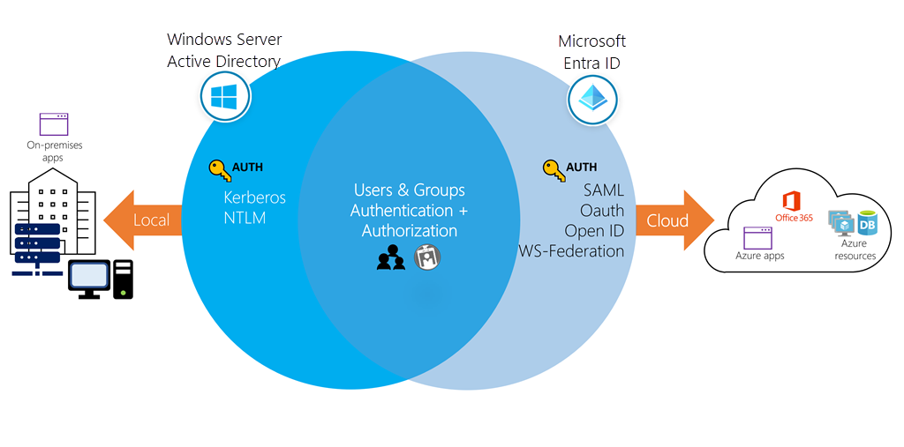
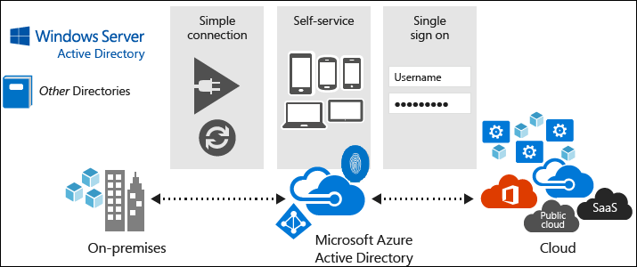
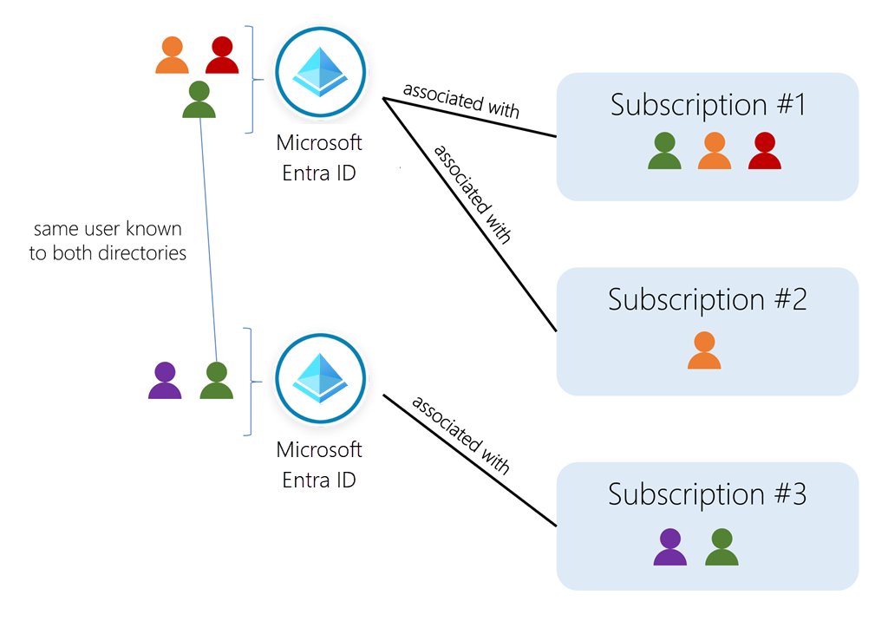
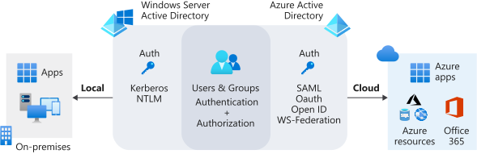

# 
Entra ID

  

## What
Though they once shared similar name, Entra ID is not cloud version of Windows Server AD. It's not intended as a complete replacement for on-premises AD. Instead, if you're already using Windows AD server, you can connect it to Entra ID to extend directory into Azure. This approach allows users to use same credentials to access local and cloud-based resources.

Entra ID stores users in a tenant that represents an org. For example, say you have a company tenant where all of employee user accounts are stored. You can add users in this tenant to groups so they have a common shared-access level. You could have one group for dev and another group for testers. Each tenant can have multiple groups that hold multiple users.

Each Entra tenant is assigned default DNS domain name, consisting of a unique prefix. The prefix, derived from the name of Microsoft account you use to create Azure sub or provided explicitly when creating a Entra tenant, is followed by `onmicrosoft.com` suffix. This name utilizes DNS domain namespace that the corresponding org owns. The Entra tenant serves as security boundary and container for Entra objects such as users, groups, and app. A single Entra tenant can support multiple Azure sub.

When an org signs up to use one of Microsoft service, such as M365, they're assigned a default directory, an instance of Entra ID. This directory holds the users and groups that will have access to each of services the company has purchased. You can refer to this default directory as a tenant. A tenant represents the organization and the default directory assigned to it. When you deploy services such as M365 or Intune, you also need to have directory services in cloud to provide authN and authZ. Because of this, each service that needs authN will create its own Entra tenant. When a single org uses more than one cloud service, it’s much more convenient for these services to use a single cloud directory instead of having separate directories for each service.

It’s possible to have one identity service that covers all Microsoft services, such as M365, Azure, and Intune. Entra ID provides dev with centralized authN and authZ for app in Azure by using other identity providers or on-premises AD DS. Entra ID can provide users with an SSO experience when using app such as Facebook or Microsoft cloud services.

Entra ID allows to define two types of groups.
1. Security groups: the most common, and are used to manage member and computer access to shared resources for a group of users. For example, you can create a security group for specific security policy. You can give a set of permissions to all members at once instead of having to add permissions to each member individually.
2. M365 groups: provide collaboration opportunities by giving members access to shared mailbox, files, and more. This option also lets you give people outside of org access to the group.

Terminology:
* Identity - object that can get authenticated. An identity can be a user with username and password. Identities also include app or other servers that might require authentication through secret keys or certificates.
* Account - identity that has data associated with it. You can't have an account without identity.
* Entra account - identity created through Entra ID or another Microsoft cloud service, such as M365. Identities are stored in Entra ID and accessible to org's cloud service sub. This account is also sometimes called a Work or school account. For example, internal staff members might use Entra accounts daily at work.
* Entra tenant - an instance of Entra ID. This tenant is automatically created when you first sign up for Azure or other services like M365. A tenant (which represents an org) holds users, user groups, and app.
* Entra directory - an Azure resource created automatically when you subscribe to Azure. You can create many Entra directories. Each of them represents a tenant.
* Custom domain - a domain you customize for your Entra directory. When you create a Entra directory, Azure automatically assigns it a default domain like `<your-organization>.onmicrosoft.com`. However, you can customize domain names. Your users could then have accounts like `user@contoso.com` instead of `user@contoso.onmicrosoft.com`.

 

### Entra External Identities
It refers to all the ways you can interact with users outside of your org. If you want to collaborate with partners, you can share your resources and define how your internal users can access external organizations. If you're a developer creating consumer-facing apps, you can manage your customers' identity experiences.

With External Identities, external users can "bring their own identities." Whether they have a corporate or government-issued digital identity, or an unmanaged social identity like Google, they can use their own credentials to sign in. The external user’s identity provider manages their identity, and you manage access to your apps with Entra ID.

  

## Entra ID vs Active Directory
You could view Entra ID simply as cloud-based counterpart of AD DS (Active Directory Domain Services); however, while Entra ID and AD DS share some common characteristics, there are several differences between them.

| Service          | Authentication            | Structure                    | Used for                                  |
|------------------|---------------------------|------------------------------|-------------------------------------------|
| Active Directory | Kerberos, NTLM             | Forests, domains, org units| AuthN and authX for on-premises resources |
| Entra ID         | SAML, OAuth, WS-Federation | Tenants                    | Internet-based services and ap like M365   |

Entra ID doesn't replace Active Directory. The service you use depends on org's needs. You can use the two services together so you can take advantage of their combined features.

 

### Characteristics of AD DS
AD DS is the traditional deployment of Windows Server-based AD. Although AD DS is commonly considered being primarily a directory service, it’s only one component of Windows AD suite of tech, which also includes AD Certificate Services (AD CS), AD Lightweight Directory Services (AD LDS), AD Federation Services (AD FS), and AD Rights Management Services (AD RMS).

Characteristics of AD DS:
* AD DS is a true directory service, with a hierarchical X.500-based structure.
* AD DS uses DNS for locating resources such as domain controllers.
* You can query and manage AD DS by using LDAP calls.
* AD DS primarily uses the Kerberos protocol for authN.
* AD DS includes computer objects, representing computers that join an AD domain.
* AD DS uses trusts between domains for delegated management.
* You can deploy AD DS on Azure vm to enable scalability and availability for an on-premises AD DS. However, it doesn't make any use of Entra ID.

 

### Characteristics of Entra ID
* Entra ID is primarily an identity solution, and it’s designed for internet-based app by using HTTP (port 80) and HTTPS (port 443) communications.
* Multi-tenant directory service.
* Entra users and groups are created in a flat structure, and there are no OUs or GPOs.
* You can't query Entra ID by LDAP; instead, it uses REST API over HTTP and HTTPS.
* Entra ID doesn't use Kerberos authentication; instead, it uses HTTP and HTTPS protocols such as SAML, WS-Federation, and OpenID Connect for authentication, and uses OAuth for authorization.
* Entra ID includes federation services, and 3P services such as Facebook are federated with and trust Entra ID.

  

## Permission and Role
Entra ID uses permissions to control the access rights a user or group is granted. This is done through roles. Entra ID has many roles with different permissions. When a user is assigned a specific role, they inherit permissions from that role. For example, a user assigned to the _User Administrator_ role can create and delete accounts.

* Administrator roles. It allow users elevated access to control who is allowed to do what.
* Member user. It is a native member of Entra org that has a set of default permissions like being able to manage profile info. When someone new joins org, they typically have this type of account created for them. Anyone who isn't a guest user or isn't assigned an administrator role falls into this type. A member user role is meant for users who are considered internal to an org and are members of Entra org.
* Guest user. It restricted Entra org permissions. When you invite someone to collaborate with your org, you add them to Entra org as guest user. Then, you can either send an invitation email that contains a redemption link or send a direct link to an app you want to share. Guest users sign in with their own work, school, or social identities. By default, Entra member users can invite guest users.

  

## Entra Domain Services
Line-of-business (LOB) app are deployed on devices that are domain members. These org use AD DS–based credentials for authentication, and Group Policy manages them. When you consider moving these apps to Azure, one key issue is how to provide authentication services. To satisfy this, you can choose to implement VPN between local infra and Azure, or deploy replica domain controllers from local AD DS as VMs in Azure.

Microsoft provides Entra Domain Services as an alternative to these approaches. This service provides domain services such as Group Policy management, domain joining, and Kerberos authentication to Entra tenant. These services are fully compatible with locally deployed AD DS, so you can use them without deploying and managing additional domain controllers.

  

## References
* [Entra admin center](https://aad.portal.azure.com/)
* [Entra ID doc](https://learn.microsoft.com/en-us/entra/identity/)
* [Entra ID fundamental](https://learn.microsoft.com/en-us/entra/fundamentals/whatis)