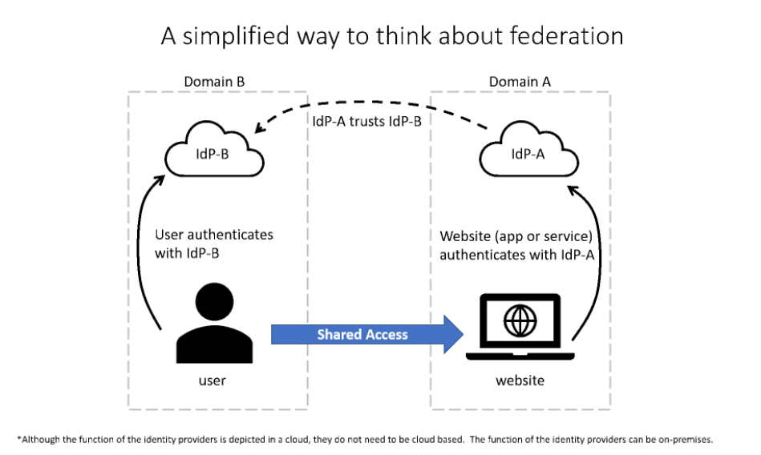

# <center>Identity</center>

<br></br>


## Service Principle
Think of an Azure service principal as proxy account—or identity—that represents app or service. Entra ID manages this account. You grant the service principal access to Azure resources that you need. Use service principal instead of embedding credentials or creating a dummy account for app.

Service principals exist at tenant level. They're used to grant access to resources in that tenant. If all resources are in same tenant, you need to associate only one service principal. If app needs access to resources in different tenant, you need a service principal for each tenant.


You can provision app for identity platform in several ways. Here, we use portal to register an app.


1. Specify any supported account types:
    1. Accounts within your company's Entra tenant.
    2. Accounts in any company's Entra tenant.
    3. Any org accounts and personal accounts, such as Xbox.

2. (Optional) Choose redirect URI parameter. Two available types are Web and Public Client. A redirect URI takes the form of a web link (HTTPS). The link doesn't need to be valid unless you select a public client.

When you finish the steps, the application is registered with Entra ID. It's also associated with a service principal.

To access resources by service principals, you need two parameters:
1. Directory (tenant) ID: Unique ID that identifies Entra tenant.
2. Application (client) ID: Unique ID that identifies Entra app.


To authenticate requests, app needs credentials. The credentials allow app to identify itself. Two forms of credentials:
1. Certificate: You generate a certificate locally, and then upload `.cer`, `.pem`, or `.crt` file. A certificate is commonly referred as public key.
2. Client secret: generated in Azure and also known as app password.

> The most secure and convenient way to handle authentication is to managed identities. Service principle is used in only two scenarios:
> 1. Application or service is running on-premises.
> 2. Resources or app don't support managed identities.

<br></br>


## Managed Identity
When you use managed identities, you don't need to include authentication information in code or make it available as part of application accessible configuration files. Managed identities provide an identity for applications to use when connecting to resources that support Entra authentication. Applications can use managed identity to obtain Entra tokens.

When you use managed identities, you don't need to rotate credentials or worry about expiring certificates. Azure handles credential rotation and expiration in background. To configure an application to use a managed identity, use the provided token to call the service.

> The term Managed Service Identity (MSI), which is still used in some client libraries, has been replaced by managed identities.

Some common terms:
* Client ID: A unique ID linked to Entra app and service principal that was created when you provisioned identity.
* Object ID: service principal object of managed identity.
* Instance Metadata Service: A REST API that's enabled when ARM provisions a VM. The endpoint is accessible only from within VM.

You can enable system-assigned managed identities directly on an Azure service instance, such as VM. When you enable managed identities, Azure creates a service principal through ARM. A system-assigned managed identity has its lifecycle linked to resource instance where it was created. For example:
* If you have two VMs and you want to use system-assigned managed identities, you need to enable managed identities on each VM.
* If resource is deleted, so is the managed identity. A resource can have only one system-assigned managed identity.

User-assigned managed identities are created as standalone Azure resources. They're independent of any app or service instance. When a user-assigned managed identity is provisioned, Azure creates a service principal just as it does for a system-assigned managed identity. However, a user-assigned managed identity isn't tied to a specific resource, so you can assign it to more than one app. For example:
* If web app is deployed on 10 front-end VMs, you can create user-assigned managed identity for app, grant the managed identity the necessary rights, and associate it with all VMs.
* If you used system-assigned managed identity, you'd need 10 identities, and you'd have to manage access for each one.

Following are common use cases for managed identities:

* System-assigned managed identity
    * Workloads contained within single resource.
    * Workloads needing independent identities.
    * For example, an application that runs on a single VM.
* User-assigned managed identity
    * Workloads that run on multiple resources and can share a single identity.
    * Workloads needing preauthorization to a secure resource, as part of a provisioning flow.
    * Workloads where resources are recycled frequently, but permissions should stay consistent.
    * For example, a workload where multiple VMs need to access the same resource.

<br>


### MI authentication flow
How system-assigned managed identity works with VM:
1. ARM receives request to enable system-assigned managed identity on a VM.
2. ARM creates service principal in  Entra ID for the identity of VM. The service principal is created in Entra tenant that's trusted by the subscription.
3. ARM configures the identity on VM by updating Azure Instance Metadata Service identity endpoint with service principal client ID and certificate.
4. After VM has an identity, use the service principal information to grant VM access to Azure resources. To call ARM, use RBAC in Entra ID to assign appropriate role to VM service principal. To call KV, grant your code access to the specific secret or key in KV.
5. Your code that's running on the VM can request a token from Azure Instance Metadata service endpoint, accessible only from within VM: `http://169.254.169.254/metadata/identity/oauth2/token`
6. A call is made to Entra ID to request access token (as specified in step 5) by using client ID and certificate configured in step 3. Entra ID returns JWT access token.
7. Your code sends access token on a call to service that supports Entra authentication.

How user-assigned managed identity works with VM:
1. ARM receives request to create user-assigned managed identity.
2. ARM creates service principal in Entra ID for user-assigned managed identity. The service principal is created in e Microsoft Entra tenant that's trusted by the subscription.
3. ARM receives request to configure user-assigned managed identity on VM and updates the Azure Instance Metadata Service identity endpoint with user-assigned managed identity service principal client ID and certificate.
4. After user-assigned managed identity is created, use the service principal information to grant identity access to resources. To call ARM, use RBAC in Entra ID to assign the appropriate role to service principal of user-assigned identity. To call KV, grant your code access to the specific secret or key in KV.
5. Your code that's running on VM can request a token from Azure Instance Metadata Service identity endpoint, accessible only from within VM: `http://169.254.169.254/metadata/identity/oauth2/token`.
6. A call is made to Entra ID to request an access token (as specified in step 5) by using client ID and certificate configured in step 3. Entra ID returns JWT access token.
7. Your code sends access token on a call to service that supports Entra authentication.

An app that runs on an Azure resource, such as VM or function app, uses managed identity to authenticate and access other resources. The authentication and access process involves a series of requests to Azure Instance Metadata Service:
1. The service validates identity that's associated with your app.
2. Generates a resource access token.
3. Your app sends token to resource that it needs to access.
4. Token is authenticated.
5. If token is valid, the resource verifies that the token represents an identity that has appropriate authorization for request.
6. When this test passes, app can access resource.

You can use `AzureServiceTokenProvider` API in code. `AzureServiceTokenProvider` object retrieves principal ID for app and generates resource access token. Use `GetAccessTokenAsync` to specify resource for which the access token should be generated. Provide the URI of service that hosts the resource.

The following generates a token for Azure Storage:

```csharp
AzureServiceTokenProvider azureServiceTokenProvider = new AzureServiceTokenProvider();
var token = await azureServiceTokenProvider.GetAccessTokenAsync("https://storage.azure.com/");
```

Other Azure Storage APIs can use this token to authenticate and to authorize access.

<br></br>


## Zero Trust
Guidance for design:

| Verify Explicitly                          | Use Least Privilege Access                                | Assume Breach                                                     |
|--------------------------------------------|-------------------------------------------------------- --|-------------------------------------------------------------------|
| Always validate all data points including: | To secure data and productivity, limit user access using: | Min blast radius for breaches and prevent lateral movement by:    |
| - User identity and location               | - Just-in-time (JIT)                                      | - Segmenting access by network, user, devices, and app awareness  |
| - Device health                            | - Just-enough-access (JEA)                                | - Encrypting all sessions end to end                              |
| - Service or workload context              | - Risk-based adaptive policies                            | - Use analytics for threat detection                              |
| - Data classification                      | - Data protection against out of band vectors             |                                                                   |
| - Anomalies                                |                                                           |                                                                   |


<br></br>


## Centralized Identity and Decentralized Identity
Centralized Identity System is a single identity tool. This system can be on-premises or cloud based. The system is centrally managed by identity authority or administrator.
* Credentials are verified when stored
* Management is by single authority
* Example: Entra ID

Decentralized identity approach helps interact with each other transparently and securely, in an identity trust fabric. People control their own digital identity and credentials. Decentralized Identifiers (DIDs) are user-generated, self-owned, globally unique identifiers rooted in decentralized systems. These attributes are critical for any ID system that is intended to provide self-ownership and user control.

To acquire a DID, you use a device under your control to download a DID User Agent app. Just as a browser is a trusted user agent that helps navigate the web, a DID User Agent helps manage all aspects of DIDs—creation of identifiers, authentication, data encryption, and management of keys and permissions.


Components of decentralized identity:
* W3C Decentralized Identifiers (DIDs) — IDs users create, own, and control independently. DIDs are globally unique identifiers linked to Decentralized Public Key Infrastructure (DPKI) metadata composed of JSON documents that contain public key material, authentication descriptors, and service endpoints.
* Decentralized systems (for example, blockchain) — DIDs are rooted in decentralized systems that provide the mechanism required for DPKI.
* DID User Agents — app that enable real people to use decentralized identities. User Agent apps aid in creating DIDs, managing data and permissions, and signing/validating DID-linked claims.
* DIF Universal Resolver — a server that utilizes a collection of DID Drivers to provide standard means of lookup and resolution for DIDs across implementations and decentralized systems and that returns DID Document Object (DDO) that encapsulates DPKI metadata associated with a DID.
* DIF Identity Hubs — a replicated mesh of encrypted personal datastores, that facilitate identity data storage and identity interactions.
* DID Attestations — DID-signed attestations are based on standard formats and protocols. They enable identity owners to generate, present, and verify claims. The beginning of trust between users of the systems.
* Decentralized apps and services — DIDs paired with Identity Hub personal datastores enable the creation of a new class of apps and services. They store data with the user’s Identity Hub and operate within the confines of the permissions they're granted.

<br></br>


## Compare Identity Providers in Azure
Active Directory Domain Services (AD DS)
* Enterprise-ready LDAP server that provides features such as identity and authentication, computer object management, group policy, and trusts.
* AD DS is a central component with on-premises, and provides core user account authentication and computer management features.

Entra ID:
* Cloud-based identity and mobile device management that provides user account and authentication services for resources such as M365, Azure, or SaaS applications.
* It can be synchronized with on-premises AD DS to provide single identity to users that works natively in cloud.

Entra Domain Services:
* Provides managed domain services with subset of fully compatible traditional AD DS features such as domain join, group policy, LDAP, and Kerberos / NTLM authentication.	Cloud-based identity and mobile device management that provides user account and authentication services for resources such as Microsoft 365, the Azure portal, or SaaS applications.	Enterprise-ready lightweight directory access protocol (LDAP) server that provides key features such as identity and authentication, computer object management, group policy, and trusts.
* It integrates with Entra ID, which itself can synchronize with on-premises AD DS. This extends central identity use cases to traditional web app that run in Azure as part of a lift-and-shift strategy.

<br></br>


## Federated User Sign-Ons
It's also known as federated authentication. It is a process that allows users to access multiple apps using a single set of login credentials. This is achieved through a trust relationship between identity providers (IdPs) and service providers (SPs).

Key concepts:
* Identity Provider (IdP). The entity that authenticates the user and provides identity information. Examples include Microsoft Entra ID, Google, and Facebook.

* Service Provider (SP). The service that the user wants to access. The SP trusts the IdP to authenticate the user.

* Security Tokens. After authenticating the user, the IdP issues a security token (such as SAML, OAuth, or OpenID Connect) that the user presents to the SP. The SP uses this token to grant access.

Federated authentication protocols:
* SAML (Security Assertion Markup Language). XML-based standard for exchanging authentication and authorization data between parties.

* OAuth 2.0. A framework that allows third-party apps to obtain limited access to an HTTP service.

* OpenID Connect. An identity layer on top of OAuth 2.0, used for authenticating users and obtaining their identity information.

Examples in Azure:
* Azure AD and Office 365

    Users can log in to Office 365 services using their Azure AD credentials, which are authenticated by Azure AD. This allows seamless access to services like Outlook, SharePoint, and Teams without separate logins.

* Azure AD B2B Collaboration

    Allows organizations to invite external users to access their resources using the external users' existing credentials from other IdPs.

* Azure AD B2C

    Enables organizations to authenticate users using a wide range of identity providers, including social accounts like Google or Facebook, or other enterprise identity providers.

<br>


### How Federated Sign-On Works
1. User Request. The user attempts to access a SP app.
2. Redirect to IdP. If the user is not already authenticated, the SP redirects the user to the IdP for authentication.
3. User Authentication. The user provides credentials to the IdP (such as a username and password). The IdP verifies these credentials.
4. Token Issuance. Upon successful authentication, the IdP issues a security token that contains the user's identity information and possibly other claims (such as group memberships or roles).
5. Token Presentation. The user is redirected back to the SP, presenting the security token.
6. Token Validation. The SP validates the security token, ensuring it is authentic and has not been tampered with. If the token is valid, the SP grants the user access to the app.

<br></br>


## X.509 Certificate
It is a digital certificate that uses the X.509 public key infrastructure (PKI) standard to verify the identity of a party, such as a server, a user, or a device.

Key components:
* Serial Number: A unique identifier assigned by the certificate authority (CA).
* Signature Algorithm: Used by the CA to sign the certificate.
* Issuer: The entity that issued the certificate (usually a CA).
* Validity Period:
    * Not Before: The date and time when the certificate becomes valid.
    * Not After: The date and time when the certificate expires.
* Subject: The entity that the certificate is issued to, such as a domain name for a website or an individual's name for a user certificate.
* Subject Public Key Info: Contains the public key and the algorithm associated with the key.
* Extensions (optional): Extra fields that can provide additional information, such as key usage, extended key usage, and subject alternative names.
* Signature: The digital signature of the issuer, which verifies the authenticity of the certificate.

How X.509 certificates work:
1. CA: A trusted organization that issues and signs X.509 certificates. The CA verifies the identity of the certificate requester before issuing a certificate.

2. Public and Private Keys: Each X.509 certificate contains a public key. The private key is kept secret by the owner. The public key is used to encrypt data or verify digital signatures, while the private key is used to decrypt data or create digital signatures.

3. Digital Signature: The CA signs the certificate using its private key. This signature ensures that the certificate has not been tampered with and that it was issued by a trusted CA.

4. Validation: When receives an X.509 certificate, it can validate the certificate by checking CA's signature using CA's public key.

Common uses of X.509 certificates:
* HTTPS (SSL/TLS): When visit a website using HTTPS, browser uses X.509 certificates to verify the identity of website and establish an encrypted connection.
* Email Security (S/MIME): X.509 certificates can be used to sign and encrypt email messages.
* VPNs: Authenticate users and devices, ensuring secure remote access to networks.
* Code Signing

<br></br>


## Service Principle
To delegate Identity and Access Management functions to Microsoft Entra ID, an app must be registered with a Microsoft Entra tenant. When you register app with Microsoft Entra ID, you're creating an identity configuration for app that allows it to integrate with Microsoft Entra ID.

If you register an app in portal, an app object (the globally unique instance of app) and a service principal object are automatically created in your home tenant. You also have a globally unique ID for your app (the app or client ID). In portal, you can then add secrets or certificates and scopes to make app work.

<br>


### application object
A Microsoft Entra app is defined by its one and only app object. The app object resides in  Microsoft Entra tenant where app was registered (known as app's "home" tenant). An app object is used as a template or blueprint to create one or more service principal objects. A service principal is created in every tenant where the app is used. Similar to a class in object-oriented programming, the app object has some static properties that are applied to all the created service principals (or app instances).

The app object describes 3 aspects of an app:
1. How the service can issue tokens in order to access the app.
2. Resources that the app might need to access.
3. The actions that the app can take.

The Microsoft Graph [app entity](https://learn.microsoft.com/en-us/graph/api/resources/application) defines the schema for an app object's properties.

<br>


### service principal object
To access resources secured by a Microsoft Entra tenant, the entity that requires access must be represented by a security principal. This is true for both users (user principal) and apps (service principal).

The security principal defines the access policy and permissions for the user/app in Microsoft Entra tenant. This enables core features such as authentication of user/app during sign-in, and authorization during resource access.

There are 2 types of service principal:
1. Application - local representation, or app instance, of a global app object in a single tenant or directory. A service principal is created in each tenant where the app is used and references the globally unique app object. The service principal object defines what the app can actually do in specific tenant, who can access app, and what resources the app can access.

2. Managed Identity - represent a managed identity. Managed identities provide an identity for apps to use when connecting to resources that support Microsoft Entra authentication. When a managed identity is enabled, a service principal representing that managed identity is created in your tenant. Service principals representing managed identities can be granted access and permissions, but can't be updated or modified directly.

<br>


### Relationship between app objects and service principals
The app object is the global representation of app for use across all tenants, and service principal is local representation for use in a specific tenant. The app object serves as the template from which common and default properties are derived for use in creating corresponding service principal objects.

An app object has:
- A one to one relationship with the software app, and
- A one to many relationships with its corresponding service principal object(s).

A service principal must be created in each tenant where the app is used to enable it to establish an identity for sign-in and/or access to resources being secured by the tenant. A single-tenant app has only one service principal (in its home tenant), created and consented for use during app registration. A multi-tenant app also has a service principal created in each tenant where a user from that tenant consented to its use.

<br></br>


## Federation Identity
Federation enables access of services across organizational or domain boundaries by establishing trust relationships between the respective domain’s identity provider. With federation, there's no need for a user to maintain a different username and password when accessing resources in other domains.



The simplified way to think about federation scenario is as follows:
- The website, in domain A, uses authentication services of Identity Provider A (IdP-A).
- The user, in domain B, authenticates with Identity Provider B (IdP-B).
- IdP-A has a trust relationship configured with IdP-B.
- When the user, who wants to access website, provides his/her credentials to website, the website trusts user and allows access. This access is allowed because of trust that is already established between two identity providers.
- Although IdP-A trusts IdP-B and allow user in domain B to access website in domain A, the opposite isn't true, unless that trust relationship is configured.

A common example of federation in practice is when user logs in third-party site with social media account, such as Twitter. In this scenario, Twitter is identity provider, and the third-party site might be using a different identity provider, such as Entra ID. There's a trust relationship between Entra ID and Twitter.

<br></br>


## References
- [Identity platform for internal](https://review.learn.microsoft.com/en-us/identity/microsoft-identity-platform/?branch=main&source=docs)
- [Integrating Entra ID with applications getting started guide](https://learn.microsoft.com/en-us/entra/identity/enterprise-apps/plan-an-application-integration)
- [Getting started on managing service principals using C#](https://learn.microsoft.com/en-us/samples/azure-samples/aad-dotnet-manage-service-principals/getting-started-on-managing-service-principals-using-c/)
- [Application and service principal objects in Entra ID](https://learn.microsoft.com/en-us/entra/identity-platform/app-objects-and-service-principals?tabs=browser)
- [Secure a .NET web app with ASP.NET Core Identity framework](https://learn.microsoft.com/en-us/training/modules/secure-aspnet-core-identity/1-introduction)