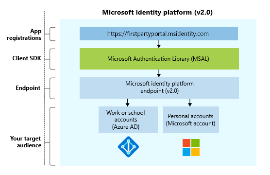
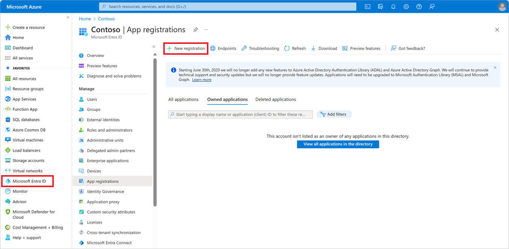

# 
Identity Platform

  

## Microsoft Identity Platform Overview
It allows developers to build app that sign in all MSFT identities and get tokens to call MSFT APIs such as Graph.

It can help internal dev create 1P app or APIs that authenticate both MSFT Entra ID (organizational) and MSFT account (consumer) users.

1P app is special compared to a standard 3P app. They're pre-authorized to call resources and as such considered privileged. Almost all public facing MSFT services such as Teams, Exchange Online, Visual Studio Codespace, Azure services, and so on, are 1P apps. Because these apps have high privilege of not requiring user consent, 1P portal allows teams to submit self-service requests to modify their apps. The 1P portal allows a specific team of approvers to approve changes.

There are several components that make up Microsoft identity platform:
1. OAuth 2.0 and OpenID Connect standard-compliant authentication service enabling developers to authenticate several identity types, including:
    - Work or school accounts, provisioned through Microsoft Entra ID
    - Personal Microsoft account, like Skype, Xbox, and Outlook.com
    - Social or local accounts, by using Azure Active Directory B2C
    - Social or local customer accounts, by using Microsoft Entra External ID

2. Open-source libraries: Microsoft Authentication Libraries (MSAL) and support for other standards-compliant libraries

3. Microsoft identity platform endpoint: Works with MSAL or any other standards-compliant library. It implements human readable scopes, in accordance with industry standards.

4. Application management portal, configuration API and PowerShell

You can provision app for identity platform in several ways. Here, we use portal to register an app.

1. Specify any supported account types:
    1. Accounts within your company's Entra tenant.
    2. Accounts in any company's Entra tenant.
    3. Any org accounts and personal accounts, such as Xbox.

2. (Optional) Choose redirect URI parameter. Two available types are Web and Public Client. A redirect URI takes the form of a web link (HTTPS). The link doesn't need to be valid unless you select a public client.

When you finish the steps, the application is registered with Entra ID. It's also associated with a service principal.

 

### First-party app concepts
Most MSFT Entra documentation applies equivalently to external (3P) and internal (1P) apps. There are a few things, however, that are unique to 1P apps:

- App registration process: There are two methods that MSFT service teams can use to manage their 1P app registrations. Traditionally, teams have created and managed their registration through MSFT identity 1P portal. As of Sep 2022, a new 1P apps repository is available. It allows service teams to manage registrations as ARM templates in a centralized repo, and deploy changes via Ev2.
- Service principal provisioning: 1P apps don't ask for user consent and so must be installed in a customer's tenant using special provisioning techniques.
- Pre-authorization process: 1P apps that call APIs don't ask for user consent and so require pre-authorization for those resources. High-privilege permissions require an extensive approval process.
- Publishing a MSFT Graph API: Resource owners may onboard API to MS Graph and publish specific scopes that enable clients to call endpoint.

  

## References
- [Microsoft identity platform overview](https://review.learn.microsoft.com/en-us/identity/microsoft-identity-platform/overview?branch=main)
- [OAuth 2.0 and OpenID Connect (OIDC) in the Microsoft identity platform](https://learn.microsoft.com/en-us/entra/identity-platform/v2-protocols)