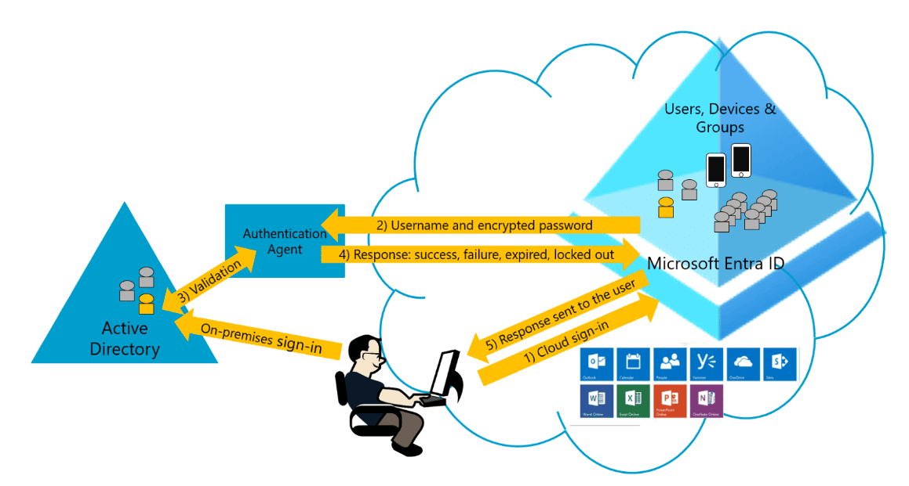

<h1 style="text-align: center;"><strong>Passthrough</strong></h1>

  

# What

Pass-through authentication (PTA) is a feature in Entra Connect that allows users to sign in to cloud resources using the same password they use on-premises. This feature is useful when you want to use Entra to manage cloud resources, but you don't want to synchronize passwords to the cloud. This feature provides users better experience - one less password to remember, and reduces IT costs because users are less likely to forget how to sign in. When users sign in using Entra ID, this feature validates users' passwords directly against their on-premises ADy.

> As a pre-requisite, users need to be provisioned into Entra ID from on-premises ADy using Entra Connect. PAT does not apply to cloud-only users.

Key security capabilities:
* Built on secure multi-tenanted architecture that provides isolation of sign-in requests between tenants.
* On-premises passwords are never stored in the cloud in any form.
* On-premises authentication agents that listen for and respond to password validation requests make only outbound connections from within your network. There's no requirement to install these authentication agents in a perimeter network (also known as DMZ, demilitarized zone, and screened subnet). As a best practice, treat all servers that are running authentication agents as Tier 0 systems.
* Only standard ports (80 and 443) are used for outbound communication from authentication agents to Entra ID. No need to open inbound ports on firewall.
    * Port 443 is used for all authenticated outbound communication.
    * Port 80 is used only for downloading certificate revocation lists (CRLs) to ensure that none of the certificates this feature uses have been revoked. The communication between agent and Entra ID is secured using certificate-based authentication. 
* Passwords that users provide during sign-in are encrypted in cloud before the on-premises authentication agents accept them for validation against Windows Server AD.
* The HTTPS channel between Entra ID and on-premises authentication agent is secured by using mutual authentication.
* Protects user accounts by working seamlessly with Entra Conditional Access policies, including MFA, blocking legacy authentication and by filtering out brute force password attacks.

  

# How PAT works
When user tries to sign in to app secured by Entra ID, and if PAT is enabled on the tenant, the following steps occur:
1. User tries to access an app, for example, Outlook Web App.
2. If user is not already signed in, user is redirected to Entra ID User Sign-in page.
3. User enters username and password into Entra sign-in page.
4. Entra ID, on receiving the request to sign in, places username and password (encrypted by using public key of Authentication Agents) in a queue.
5. An on-premises Authentication Agent retrieves username and encrypted password from queue. Note that Agent doesn't frequently poll for requests from queue, but retrieves requests over a pre-established persistent connection.
6. Agent decrypts password by its private key.
7. Agent validates username and password against ADy by using standard Windows APIs, which is a similar mechanism to what ADy Federation Services (AD FS) uses. The username can be either the on-premises default username, usually `userPrincipalName`, or another attribute configured in Entra Connect (known as Alternate ID).
8. The on-premises ADy domain controller (DC) evaluates the request and returns appropriate response (success, failure, password expired, or user locked out) to agent.
9. Authentication Agent, in turn, returns this response back to Entra ID.
10. Entra ID evaluates response and responds to the user as appropriate. For example, Entra ID either signs the user in immediately or requests for Entra MFA.

 

## Authentication Agent Registration
Entra ID assigns each authentication agent a unique, digital identity certificate that it can use for secure communication with Entra ID. The registration procedure also binds the authentication agent with your tenant. Then, Entra ID knows that this specific authentication agent is the only one that's authorized to handle password validation requests for your tenant. This procedure is repeated for each new authentication agent that you register.

Steps:
1. Entra first requests that a Hybrid Identity Administrator sign in to Entra ID with their credentials. During sign-in, the authentication agent acquires an access token that it can use on behalf of the user.

2. Authentication agent generates a key pair: public and private key. The key pair is generated through standard RSA 2,048-bit encryption. The private key stays on on-premises server where authentication agent resides.

3. Authentication agent makes a registration request to Entra ID over HTTPS, with the following components included in request:
    1. Access token that the agent acquired.
    1. Public key that was generated.
    3. A Certificate Signing Request (CSR or Certificate Request). This request applies for a digital identity certificate, with Entra ID as its certificate authority (CA).

4. Entra ID validates access token in registration request and verifies that the request came from a Hybrid Identity Administrator.

5. Entra ID signs a digital identity certificate and sends it back to authentication agent.
    1. The root CA in Entra ID is used to sign the certificate.
    2. The CA is used only by pta.
    3. The CA is used only to sign CSRs during authentication agent registration.
    4. No other Entra service uses this CA.
    5. The certificate’s subject (also called Distinguished Name or DN) is set to your tenant ID. This DN is a GUID that uniquely identifies your tenant. This DN scopes the certificate for use only with your tenant.

6. Entra ID stores public key of authentication agent in Azure SQL Database. Only Entra ID can access the database.

7. The certificate that's issued is stored on on-premises server in Windows certificate store (`CERT_SYSTEM_STORE_LOCAL_MACHINE`). The certificate is used by both authentication agent and Updater application.

 

## Authentication Agent Initialization
When authentication agent starts, either for the first time after registration or after a server restart, it needs a way to communicate securely with Entra service so that it can start to accept password validation requests.

Steps:
1. Authentication agent makes outbound bootstrap request to Entra ID. This request is made over port 443 and is over a mutually authenticated HTTPS channel.
2. The request uses same certificate that was issued during authentication agent registration. Entra ID responds to the request by providing an access key to a Service Bus queue that's unique to your tenant, and which is identified by your tenant ID.
3. Authentication agent makes a persistent outbound HTTPS connection (over port 443) to queue.

 

## How Processes Sign-in

Steps:
1. A user tries to access an app, for example, Outlook Web App.
2. If user isn't already signed in, the app redirects it to the Entra sign-in page.
3. Entra STS service responds back with User sign-in page.
4. Username and password are submitted to Entra STS in HTTPS POST request.
5. Entra STS retrieves public keys for all authentication agents that are registered on your tenant from Azure SQL Database and encrypts password by the keys. It produces one encrypted password value for each authentication agent registered on your tenant.
6. Entra STS places password validation request, which consists of username and encrypted password values, in Service Bus queue that's specific to your tenant.
7. Because the initialized authentication agents are persistently connected to Service Bus queue, one of the available authentication agents retrieves the password validation request.
8. Authentication agent uses an identifier to locate encrypted password value that's specific to its public key. It decrypts public key by using its private key.
9. Authentication agent attempts to validate username and password against Windows Server AD by using Win32 `LogonUser` API with `dwLogonType` parameter set to `LOGON32_LOGON_NETWORK`.
10. Authentication agent receives the result from Windows Server AD, such as success, username or password is incorrect, or password is expired. If authentication agent fails during sign-in process, the entire sign-in request is dropped. Sign-in requests aren't handed off from one on-premises authentication agent to another on-premises authentication agent. These agents communicate only with cloud, and not with each other.
11. Authentication agent forwards result back to Entra STS over outbound mutually authenticated HTTPS channel over port 443. Mutual authentication uses the certificate that was issued to authentication agent during registration.
12. Entra STS verifies that this result correlates with the specific sign-in request on your tenant.
13. Entra STS continues with sign-in procedure as configured. For example, if password validation was successful, user might be challenged for MFA or be redirected back to app.

 

## Renew Authentication Agent
Entra ID periodically renews authentication agent certificates. Entra ID triggers the renewals. The renewals aren't governed by authentication agents themselves.

Steps:
1. Authentication agent pings Entra every few hours to check if it's time to renew certificate. Certificate is renewed 30 days before it expires. This check is done over mutually authenticated HTTPS channel and uses same certificate that was issued during registration.
2. If service indicates that it's time to renew, authentication agent generates a new pair of public and private key. Theses are generated through standard RSA 2,048-bit encryption. Private key never leaves on-premises server.
3. Authentication agent makes certificate renewal request to Entra ID over HTTPS. The following components are included in request:
    - The existing certificate that's retrieved from `CERT_SYSTEM_STORE_LOCAL_MACHINE` location in Windows certificate store.
    - Public key generated in step 2.
    - A CSR. This request applies for a new digital identity certificate, with Entra ID as its CA.
4. Entra ID validates the existing certificate in renewal request. Then it verifies the request came from authentication agent that's registered on your tenant.
5. If the existing certificate is still valid, Entra ID signs a new digital identity certificate and issues new certificate back to authentication agent.
6. If the existing certificate has expired, Entra ID deletes authentication agent from your tenant’s list of registered authentication agents. Then a Hybrid Identity Administrator must manually install and register a new authentication agent.
7. Entra ID stores new public key of authentication agent in Azure SQL that only it has access to. It also invalidates the old public key associated with authentication agent.
8. New certificate (issued in step 5) is then stored on server in Windows certificate store (`CERT_SYSTEM_STORE_CURRENT_USER`).

  

# Limitations
Supported scenarios:
* User sign-ins to web browser-based applications.
* User sign-ins to legacy Office client applications and Office applications that support modern authentication: Office 2013 and 2016 versions.
* User sign-ins to legacy protocol applications such as PowerShell version 1.0 and others.

Unsupported scenarios:
* Detection of users with leaked credentials.
* Entra Domain Services needs Password Hash Synchronization to be enabled on the tenant. Therefore tenants that use PTA only don't work for scenarios that need Entra Domain Services.
* PTA is not integrated with Entra Connect Health.
* Signing in to Entra joined (AADJ) devices with a temporary or expired password is not supported for PTA users. The error "the sign-in method you're trying to use isn't allowed" will appear. These users must sign in to a browser to update their temporary password.

# References
- [User sign-in with Entra pass-through authentication](https://learn.microsoft.com/en-us/entra/identity/hybrid/connect/how-to-connect-pta)