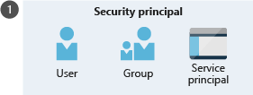

# 
Azure RBAC

  

## How Azure RBAC Works
To create a role assignment, you need security principal, role definition, and scope. You can think of them as "who," "what," and "where."

A security principal is a fancy name for user, group, or app to which you want to grant access.

Role definition is a collection of permissions.

Scope is the level where the access applies. This is helpful if you want to make someone a Website Contributor, but only for one resource group. You can specify scope at multiple levels: management group, subscription, resource group, or resource. Scopes are structured in a parent-child relationship. When you grant access at a parent scope, those permissions are inherited by the child scopes.

  

## Entra vs Azure RBAC
You use Azure roles to manage access to virtual machines, storage, and other Azure resources. You use Microsoft Entra roles to manage access to Microsoft Entra resources, such as user accounts and passwords.

The main difference between Azure roles and Entra roles is the areas they cover. Azure roles apply to Azure resources, and Entra roles apply to Entra resources (users, groups, and domains). Also, Entra ID has only one scope: directory. Azure RBAC scope covers management groups, sub, resource groups, and resources.

The roles share a key area of overlap. A Entra Global Administrator can elevate access to manage all Azure sub and management groups. This greater access grants them Azure RBAC User Access Administrator role for all sub of their directory. Through User Access Administrator role, Global Administrator can give other users access to Azure resources.

  
