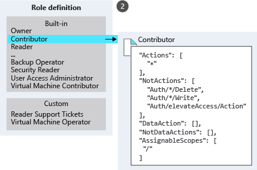

# 
Azure RBAC

  

## Introduction
To create a role assignment, you need security principal, role definition, and scope. You can think of them as "who," "what," and "where."

| Concept            | Description                                                                       | Examples                                                                                                               |
|--------------------|-----------------------------------------------------------------------------------|------------------------------------------------------------------------------------------------------------------------|
| Security principal | An object that represents something that requests access to resources.            | User, group, service principal, managed identity                                                                       |
| Role definition    | A set of permissions that lists allowed operations.                               | Some built-in role definitions: Reader, Contributor, Owner, User Access Administrator                                  |
| Scope              | The boundary for requested level of access, or "how much" access is granted.      | Management group, subscription, resource group, resource                                                               |
| Role assignment    | An assignment attaches role definition to security principal at particular scope. | Assign User Access Administrator to admin group scoped to management group Assign Contributor to user scoped to sub |

A security principal is a fancy name for user, group, or app to which you want to grant access.

Role definition is a collection of permissions.

Scope is the level where the access applies. This is helpful if you want to make someone a Website Contributor, but only for one resource group. You can specify scope at multiple levels: management group, subscription, resource group, or resource. Scopes are structured in a parent-child relationship. When you grant access at a parent scope, those permissions are inherited by the child scopes.

More examples:
* Scope a role as available for assignment in two subscriptions: `/subscriptions/c276fc76-9cd4-44c9-99a7-4fd71546436e`, `/subscriptions/e91d47c4-76f3-4271-a796-21b4ecfe3624`.
* Scope a role as available for assignment only in Network resource group: `/subscriptions/c276fc76-9cd4-44c9-99a7-4fd71546436e/resourceGroups/Network`.

  

## Entra vs Azure RBAC
Three types of roles are available for access management in Azure:
1. Classic subscription administrator roles
2. Azure RBAC roles
3. Entra administrator roles

> History: When Azure was initially released, access to resources was managed with just three administrator roles: Account Administrator, Service Administrator, and Co-Administrator. Access was controlled by assigning admin roles to subscriptions.
> Later, RBAC was added.
> In addition to RBAC, Entra ID provides built-in administrator roles to manage Entra resources like users, groups, and domains.

You use Azure roles to manage access to storage and other Azure resources. You use Entra roles to manage access to Entra resources, such as user accounts and passwords. The main difference between Azure roles and Entra roles is the areas they cover. Azure roles apply to Azure resources, and Entra roles apply to Entra resources (users, groups, and domains). Also, Entra ID has only one scope: directory. Azure RBAC scope covers management groups, sub, resource groups, and resources.

The roles share a key area of overlap. A Entra Global Administrator can elevate access to manage all Azure sub and management groups. This greater access grants them Azure RBAC User Access Administrator role for all sub of their directory. Through User Access Administrator role, Global Administrator can give other users access to Azure resources.

|                   | Azure RBAC roles                                                                              | Microsoft Entra ID admin roles                                                 |
|-------------------|-----------------------------------------------------------------------------------------------|--------------------------------------------------------------------------------|
| Access management | Manages access to resources                                                                   | Manages access to Entra resources                                              |
| Scope assignment  | Scope can be specified at multiple levels, including management group, sub, rg, and resources | Scope is specified at tenant level                                             |
| Role definitions  | Roles can be defined via  portal, CLI, ...etc.                                                | Roles can be defined via admin portal, M365 admin portal, and Graph PowerShell |

  
