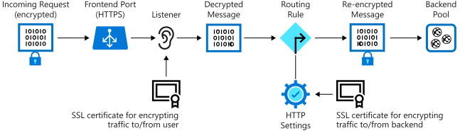
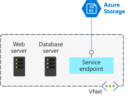

# 
Network

  

## Application Gateway Components
The following shows how incoming traffic to Application Gateway over SSL is decrypted and then re-encrypted when it's sent to server in backend pool.

Traffic enters gateway through frontend port. You can open many ports, and Application Gateway can receive messages on any of these ports. A listener is the first thing traffic meets when entering gateway through port. It's set up to listen for specific host name and specific port on specific IP. The listener can use SSL certificate to decrypt traffic that enters the gateway. The listener then uses a rule to direct incoming requests to backend pool.

The backend pool contains application servers. These servers might be VM, VMSS, or app running on App Service. Incoming requests can be load balanced across servers in this pool. The backend pool has HTTP setting that references certificate used to authenticate  backend servers. Gateway re-encrypts traffic by using this certificate before sending it to one of your servers in backend pool.

If you're using App Service to host backend app, you don't need to install any certificates in Application Gateway to connect to back-end pool. All communications are automatically encrypted. Application Gateway trusts servers because Azure manages them.

  

## Azure VPN Gateway
Virtual network gateway provides endpoint for incoming connections from on-premises locations to Azure over Internet. A VPN gateway is a specific type of virtual network gateway that can be an endpoint for encrypted connections. It can also send encrypted traffic between Azure virtual networks over Microsoft's dedicated network that links Azure datacenters in different regions. This configuration enables you to link vms and services in different regions securely.

Each virtual network can have only one VPN gateway. All connections to that VPN gateway share the available network bandwidth.

Within each virtual network gateway, there are two or more VMs. These VMs have been deployed to special subnet, called gateway subnet. They contain routing tables for connections to other networks, along with specific gateway services. These VMs and gateway subnet are similar to a hardened network device.

  

## Azure ExpressRoute
Azure ExpressRoute enables organizations to extend on-premises networks into Microsoft Cloud over private connection implemented by connectivity provider. This arrangement means that the connectivity to Azure datacenters doesn't go over internet but across dedicated link.

  

## Virtual Network Service Endpoint
Use virtual network service endpoints to extend your private address space in Azure by providing a direct connection to your Azure services. Service endpoints let you secure your Azure resources to only your virtual network. Service traffic will remain on the Azure backbone, and doesn't go out to the internet.

By default, Azure services are designed for direct internet access. All Azure resources have public IP addresses, including PaaS services such as Azure SQL Database and Azure Storage. Because these services are exposed to the internet, anyone can potentially access your Azure services.

Service endpoints can connect certain PaaS services directly to your private address space in Azure, so they act like they’re on the same virtual network. Adding service endpoints doesn't remove the public endpoint. It simply provides a redirection of traffic.

 

### How Service Endpoint Works
To enable service endpoint:
* Turn off public access to the service.
* Add service endpoint to virtual network.

When you enable a service endpoint, you restrict the flow of traffic and enable your VMs to access the service directly from private address space. Devices cannot access the service from a public network. On a deployed VM vNIC, if you look at Effective routes, you'll notice the service endpoint as the Next Hop Type.

This is an example route table before enabling a service endpoint:

| SOURCE  | STATE  | ADDRESS PREFIXES  | NEXT HOP TYPE |
|---------|--------|-------------------|---------------|
| Default | Active | 10.1.1.0/24       | VNet          |
| Default | Active | 0.0.0.0/0         | Internet      |
| Default | Active | 10.0.0.0/8        | None          |
| Default | Active | 100.64.0.0/10     | None          |
| Default | Active | 192.168.0.0/16    | None          |

And here's an example route table after you've added two service endpoints to virtual network:

| SOURCE  | STATE  | ADDRESS PREFIXES          | NEXT HOP TYPE                    |
|---------|--------|---------------------------|----------------------------------|
| Default | Active | 10.1.1.0/24               | VNet                             |
| Default | Active | 0.0.0.0/0                 | Internet                         |
| Default | Active | 10.0.0.0/8                | None                             |
| Default | Active | 100.64.0.0/10             | None                             |
| Default | Active | 192.168.0.0/16            | None                             |
| Default | Active | 20.38.106.0/23, 10 more   | VirtualNetworkServiceEndpoint    |
| Default | Active | 20.150.2.0/23, 9 more     | VirtualNetworkServiceEndpoint    |

All traffic for the service now is routed to `VirtualNetworkServiceEndpoint` and remains internal to Azure.

 

### Service endpoints and hybrid networks
To access resources from on-premises network, use NAT IPs. If you use ExpressRoute for connectivity from on-premises to Azure, you have to identify NAT IP ExpressRoute uses. By default, each circuit uses two NAT IP to connect to Azure backbone network. You need to add these IPs into Azure service resource's IP firewall configuration (for example, Azure Storage).

  

## References
* [Encrypt network traffic end to end with Azure Application Gateway](https://learn.microsoft.com/en-us/training/modules/end-to-end-encryption-with-app-gateway/)
* [Explore Azure ExpressRoute](https://learn.microsoft.com/en-us/training/modules/configure-network-for-azure-virtual-machines/6-describe-azure-expressroute)