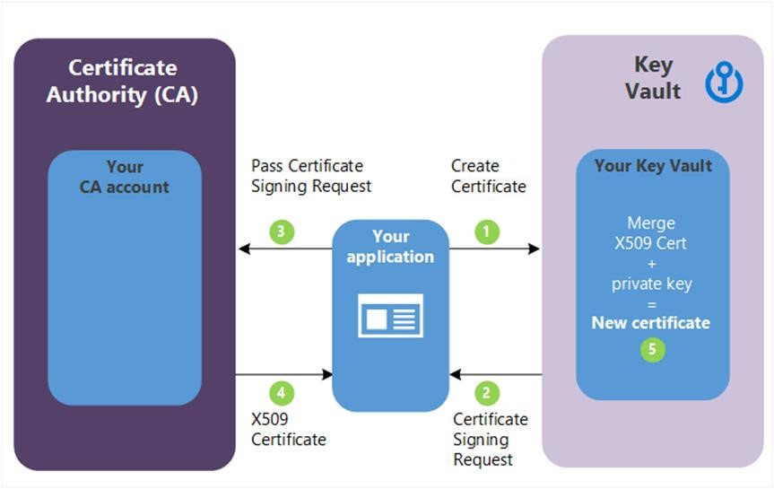
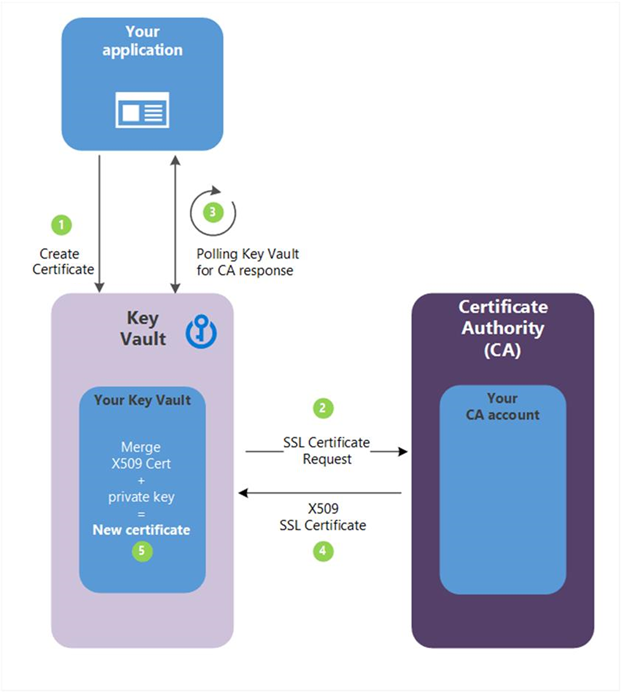

# <center>Key Vault</center>

<br></br>


## What
Key Vault solves the following problems:

* Secrets Management: securely store and tightly control access to tokens, passwords, certificates, API keys, and other secrets.
* Key Management: Key Vault can be used as key management solution.
* Certificate Management

Azure Key Vault has two service tiers:
1. Standard, which encrypts with a software key.
2. Premium tier, which includes hardware security module (HSM)-protected keys.

<br></br>


## Best Practices
* Use separate key vaults. Recommended using a vault per app per environment (Development, Pre-Production and Production). This helps you not share secrets across environments.
* Control access to vault.
* Backup
* Logging
* Recovery options: Turn on soft-delete and purge protection if you want to guard against force deletion of secret.

<br>

.
### Authentication
To do any operations with Key Vault, you first need to authenticate to it. There are 3 ways to authenticate:

1. Managed identities. When deploy an app on a vm, you can assign an identity to vm that has access to Key Vault. The benefit of this approach is app or service isn't managing the rotation of the first secret. Azure automatically rotates service principal client secret associated with the identity. It is highly recommended.

2. Service principal and certificate. You can use a service principal and an associated certificate that has access to Key Vault. We don't recommend this because app owner or developer must rotate certificate.

3. Service principal and secret. Although you can use a service principal and a secret to authenticate to Key Vault, we don't recommend it. It's hard to automatically rotate the bootstrap secret that's used to authenticate to Key Vault.

<br>


### Encryption of data in transit
Key Vault enforces Transport Layer Security (TLS) protocol to protect data when it’s traveling between Key Vault and clients. Clients negotiate a TLS connection with Key Vault.

Perfect Forward Secrecy (PFS) protects connections between customers’ client systems and Microsoft cloud services by unique keys. Connections also use RSA-based 2,048-bit encryption key lengths.

<br></br>


## Authenticate to Key Vault
Access tokens must be sent to service using HTTP Authorization header:

```
PUT /keys/MYKEY?api-version=<api_version>  HTTP/1.1
Authorization: Bearer <access_token>
```

When an access token isn't supplied, or when a token isn't accepted by service, a 401 error is returned and will include `WWW-Authenticate` header, for example:

```
401 Not Authorized
WWW-Authenticate: Bearer authorization="…", resource="…"
```

The parameters on `WWW-Authenticate` header are:
* `authorization`: address of OAuth2 authorization service that may be used to obtain access token for request.
* `resource`: resource name (`https://vault.azure.net`) to use in authorization request.

<br></br>


## Add Certificates to KV
KVt manages X.509 based certificates that can come from several sources.

First, you can create self-signed certificates directly in portal. This process creates a public/private key pair and signs certificate with its own key. These certificates can be used for testing and development.

Second, you can create X.509 certificate signing request (CSR). This process creates a public/private key pair in KV along with a CSR you can pass over to your certification authority (CA). The signed X.509 certificate can then be merged with held key pair to finalize certificate in KV as shown in the diagram.



1. Your app is creating a certificate, which internally begins by creating a key in KV.
2. KV returns a Certificate Signing Request (CSR) to your app.
3. Your app passes CSR to your chosen CA.
4. Your chosen CA responds with X.509 Certificate.
5. Your app completes new certificate creation with merger of X.509 Certificate from your CA.

This approach works with any certificate issuer and provides better security than handling CSR directly. The process is more secure because private key is created and secured in KV and never revealed.

Third, you can connectKV with trusted certificate issuer (referred to as integrated CA) and create certificate directly in KV. This approach requires a one-time setup to connect certificate authority. You can then request to create a certificate and KV interacts directly with CA to fulfill request in a similar process to the manual CSR creation process shown previously. This process are presented in following diagram.



1. Your app is creating a certificate, which begins internally by creating a key in KV.
2. KV sends an SSL Certificate Request to CA.
3. Your app polls, in a loop and wait process, for your KV for certificate completion. The certificate creation is complete when KV receives CA’s response with x509 certificate.
4. CA responds to KV's SSL Certificate Request with X509 SSL Certificate.
5. Your new certificate creation completes with merger of X509 Certificate for CA.

This approach has several distinct advantages. Because KV is connected to the issuing CA, it can manage and monitor the lifecycle of the certificate. That means it can automatically renew certificate, notify you about expiration, and monitor events such as whether the certificate has been revoked.

Finally, you can import existing certificates - importing allows you to add certificates to KV that you're already using. The imported certificate can be in either PFX or PEM format and must contain the private key. 

<br></br>


## Link
* [Key Vault developer's guide](https://learn.microsoft.com/en-us/azure/key-vault/general/developers-guide)
* [Key Vault availability and redundancy](https://learn.microsoft.com/en-us/azure/key-vault/general/disaster-recovery-guidance)
* [Exercise: Set and retrieve a secret from Key Vault by using Azure CLI](https://learn.microsoft.com/en-us/training/modules/implement-azure-key-vault/5-set-retrieve-secret-azure-key-vault)